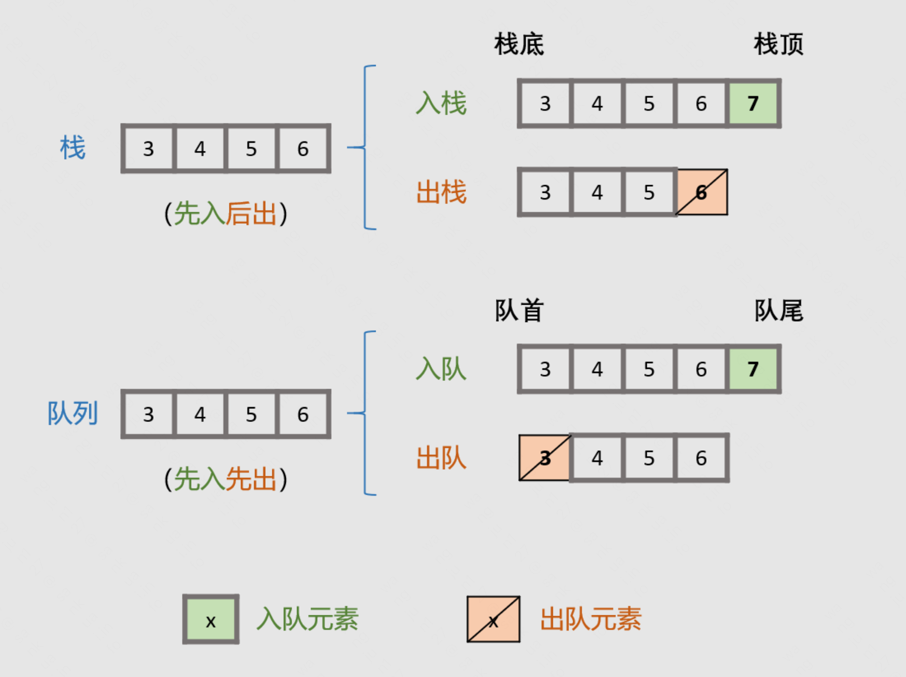
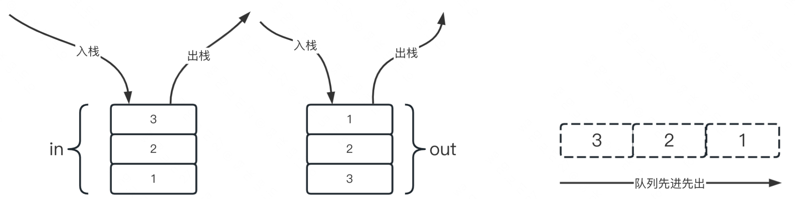
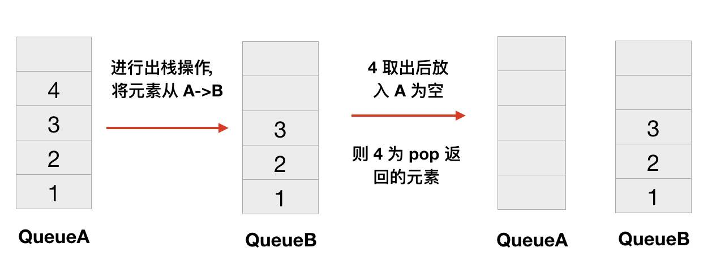
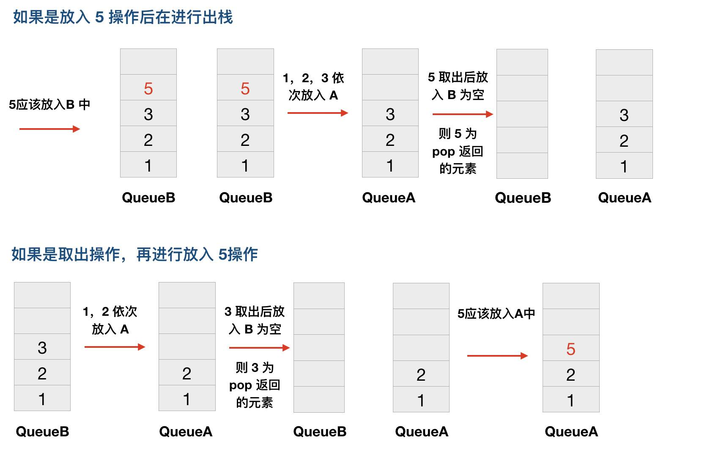

# 队列和栈

## 两个栈实现一个队列

- 方法：
  
- 优化：
    - 入队时，将元素压入s1。
    - 出队时，判断s2是否为空，如不为空，则直接弹出顶元素；如为空，则将s1的元素逐个“倒入”s2，把最后一个元素弹出并出队。

## 两个队列实现栈

- 任何时候两个队列总有一个是空的。
- 添加元素总是向非空队列中 add 元素。
- 取出元素的时候总是将元素除队尾最后一个元素外，导入另一空队列中，最后一个元素出队。

## 获取单链表的中间节点

- 输入链表头节点，奇数长度返回中点，偶数长度返回上中点
- 输入链表头节点，奇数长度返回中点，偶数长度返回下中点
- 输入链表头节点，奇数长度返回中点前一个，偶数长度返回上中点前一个
- 输入链表头节点，奇数长度返回中点前一个，偶数长度返回下中点前一个

# 单调队列 Monotonous Queue

- 使用单调队列，实现窗口内最大值或最小值的更新结构
- 能够方便获取某个区间内（滑动窗口）的最大值或最小值

# 单调栈 Monotonous Stack

- 使用单调栈，实现最临近的大于或小于关系的更新结构
- 能够方便获取大于或小于当前值的最邻近的位置

