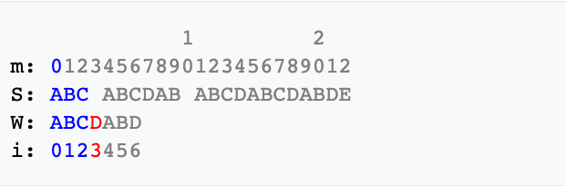
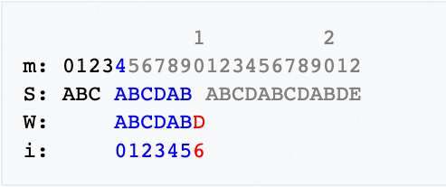
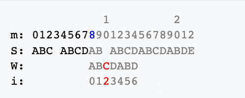
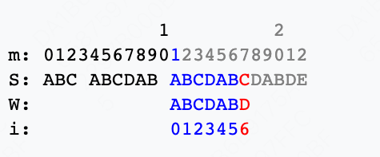
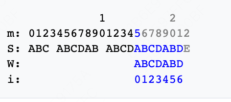
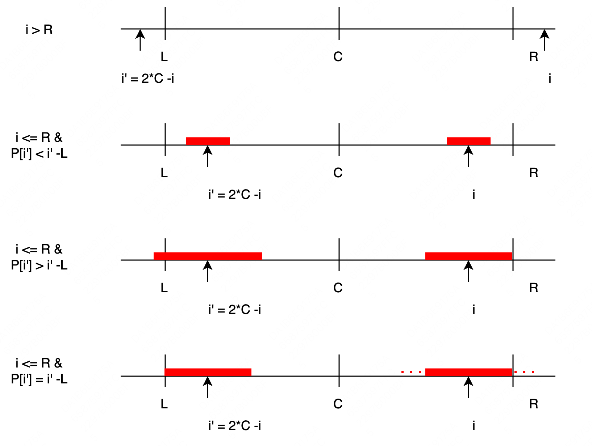

# KMP - str1 是否包含 str2

- 字符串匹配算法
- 尽可能利用残余的信息，是KMP算法的思想所在。
- 以W="ABCDABD"，S="ABC ABCDAB ABCDABCDABDE"为例说明查找过程。查找过程同时使用两个循环变量m和i：
    - m代表主文字符串S内匹配字符串W的当前查找位置，
    - i代表匹配字符串W当前做比较的字符位置。如图：
      
    - 从W与S的开头比较起。比对到S[3](=' ')时，发现W[3](='D')与之不符。接著并不是从S[1]比较下去。已经知道S[1]~S[3]不与W[0]相合。因此，略过这些字元，令m = 4以及i = 0。
      
    - 如上所示，检核了"ABCDAB"这个字串。然而，下一字符便不相合。可以注意到，"AB"在"ABCDAB"的头尾处均有出现。这意味著尾端的"AB"可以作为下次比较的起始点。因此，令m = 8, i = 2，继续比较。图示如下：
      
    - 于m = 10的地方，又出现不相符的情况。类似地，令m = 11, i = 0继续比较：
      
    - 这时，S[17](='C')不与W[6]相同，但是已匹配部分"ABCDAB"亦为首尾均有"AB"，采取一贯的作法，令m = 15和i = 2，继续搜寻。
      
    - 找到完全匹配的字串了，其起始位置于S[15]的地方。
- 求 next 数组
-
- 参考
    - [KMP 算法](https://zq99299.github.io/dsalg-tutorial/dsalg-java-hsp/14/04.html#%E5%BA%94%E7%94%A8%E5%9C%BA%E6%99%AF-%E5%AD%97%E7%AC%A6%E4%B8%B2%E5%8C%B9%E9%85%8D%E9%97%AE%E9%A2%98)
    - [KMP 算法](https://www.cnblogs.com/zzuuoo666/p/9028287.html)

# Manacher算法 - 最长回文子串

- Manacher算法的预处理
    - Manacher算法对偶数字符串做了预处理，这个预处理可以巧妙的让所有（包括奇和偶）字符串都变为奇数回文串。
    - 例如：abba --> #a#b#b#a#
    - 从预处理后的字符串得到的最长回文字符串的长度除以 2 就是原字符串的最长回文子串长度，也就是我们想要得到的结果。
- Manacher算法核心概念
    - 回文半径 p ：经过处理后的字符串的长度一定是奇数，回文半径就是以回文中心字符的回文子串长度的一半。
    - 回文半径数组 P[] ,该数组记录以每个字符为中心，对应的最长回文半径。
    - 最右回文边界 R ：遍历字符串时，每个字符的最长回文子串都会有个右边界，而 R 则是所有已知右边界中最右的位置。R值保持单增。
    - 回文中心 C ： R 对应的回文中心
- 算法流程
    - 将原字符串转换为 Manacher String，定义为 S
    - 初始化 R 、C、P[] ：R = -1 ； C = -1，P[] = new int[]; **实际是最右边界位置的右一位**
    - 遍历数组 arr[i]
      - 当 i <= R 时，可以参考 i 相对于 C 的映射 i' = 2*C - i, 其中 i' - L ==  R - i
        - P[i'] < i' - L 时，P[i] = P[i']; 原因：以 C 为中心的最大回文子串的边界是 L 和 R，如果 P[i] != P[i'] 则违反这个前提
        - P[i'] > i' - L 时，P[i] = i' - L; 原因：以 C 为中心的最大回文子串的边界是 L 和 R，如果 P[i] != i' - L 则违反这个前提
        - P[i'] == i' - L 时，P[i] >=  i' - L; 原因：P[i] ==  i' - L 后，可能还可以往外扩
      - 当 i > R 时，P[i'] 没有参考价值，直接计算

    

- 参考
    - [Manacher](https://liuchang.men/2020/12/29/%E6%9C%80%E9%95%BF%E5%9B%9E%E6%96%87%E5%AD%90%E4%B8%B2%E7%AE%97%E6%B3%95%E2%80%94%E2%80%94Manacher%E7%AE%97%E6%B3%95/)
    - [leetcode](https://leetcode.wang/leetCode-5-Longest-Palindromic-Substring.html)

