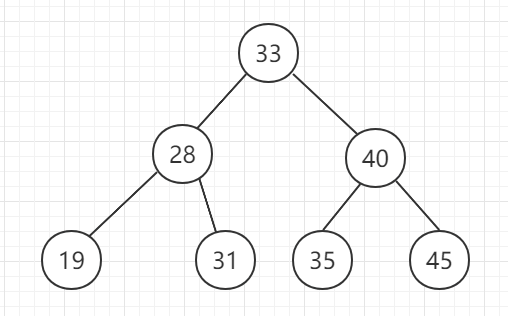
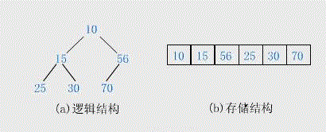

# 树结构

## 搜索二叉树

二分搜索树（英语：Binary Search Tree），也称为 二叉查找树 、二叉搜索树 、有序二叉树或排序二叉树。满足以下几个条件：

- 若它的左子树不为空，左子树上所有节点的值都小于它的根节点。
- 若它的右子树不为空，右子树上所有的节点的值都大于它的根节点。

## 平衡二叉树（ avl 树）

平衡二叉查找树：简称平衡二叉树。由前苏联的数学家 Adelse-Velskil 和 Landis 在 1962 年提出的高度平衡的二叉树，根据科学家的英文名也称为 AVL 树。它具有如下几个性质：

- 可以是空树。
- 假如不是空树，任何一个结点的左子树与右子树都是平衡二叉树，并且高度之差的绝对值不超过 1。

## 满二叉树

对于满二叉树，除最后一层无任何子节点外，每一层上的所有结点都有两个子结点二叉树。

## 完全二叉树

若设二叉树的深度为h，除第 h 层外，其它各层 (1～h-1) 的结点数都达到最大个数，第 h 层所有的结点都连续集中在最左边，这就是完全二叉树。

## Heap 堆

Heap 是一种数据结构具有以下的特点：

- 完全二叉树；
- heap中存储的值是偏序；
- Min-heap 小根堆: 父节点的值小于或等于子节点的值；
- Max-heap 大根堆: 父节点的值大于或等于子节点的值；
- heapInsert(arr,idx) idx 上面的树是符合规则的，往上移动
- heapify(arr,idx,heapSize) idx 下面的树是符合规则的，往下沉

## Trie 前缀树

在计算机科学中，trie，又称前缀树或字典树，是一种有序树，用于保存关联数组，其中的键通常是字符串。与二叉查找树不同，键不是直接保存在节点中，而是由节点在树中的位置决定。一个节点的所有子孙都有相同的前缀，也就是这个节点对应的字符串，而根节点对应空字符串。一般情况下，不是所有的节点都有对应的值，只有叶子节点和部分内部节点所对应的键才有相关的值。

## 并查集

#### 基于size的合并

我们可以引入另外一个叫做Size的数组，专门用来记录每一个集合都有多少个元素，然后在进行联合操作的时候，我们借用Size数组来查询需要合并的两个集合当中哪一个集合中的元素个数比较少，
我们就可以把Size数小的集合并入Size数大的集合当中去。这样，就能大大的减少因为合并造成树的层数过高的现象，提高find效率。

#### 基于递归的路径压缩

压缩后所有的节点都指向根节点，这种情况下，我们搜索任何节点的根节点都最多只需要一步就能够完成

# 二叉树的解题技巧

介绍二叉树的递归套路

- 1）假设以X节点为头，假设可以向X左树和X右树要任何信息
- 2）在上一步的假设下，讨论以X为头节点的树，得到答案的可能性（最重要）
- 3）列出所有可能性后，确定到底需要向左树和右树要什么样的信息
- 4）把左树信息和右树信息求全集，就是任何一棵子树都需要返回的信息S
- 5）递归函数都返回S，每一棵子树都这么要求
- 6）写代码，在代码中考虑如何把左树的信息和右树信息整合出整棵树的信息

## 二叉树遍历 - 递归方式

## 二叉树遍历 - 非递归方式

## 二叉树按层遍历 - 广度优先遍历

## 二叉树最大宽度和高度

## 二叉树序列化和反序列化

## 二叉树某个节点的后继节点

https://leetcode.com/problems/encode-n-ary-tree-to-binary-tree

## 折纸问题

请把一段纸条竖着放在桌子上，然后从纸条的下边向上方对折1次，压出折痕后展开 此时折痕是凹下去的，即折痕突起的方向指向纸条的背面 如果从纸条的下边向上方连续对折2次，压出折痕后展开 此时有三条折痕，从上到下依次是下折痕、下折痕和上折痕。
给定一个输入参数N，代表纸条都从下边向上方连续对折N次 请从上到下打印所有折痕的方向。 N=1时，打印: down N=2时，打印: down down up

# 线段树 SegmentTree

- 线段树是一种二叉搜索树，与区间树相似，它将一个区间划分成一些单元区间，每个单元区间对应线段树中的一个叶结点。
- 使用线段树可以快速的查找某一个节点在若干条线段中出现的次数，时间复杂度为O(logN)。而未优化的空间复杂度为2N，实际应用时一般还要开4N的数组以免越界，因此有时需要离散化让空间压缩。
- 对于线段树中的每一个非叶子节点[a,b]，它的左儿子表示的区间为[a,(a+b)/2]，右儿子表示的区间为[(a+b)/2+1,b]。因此线段树是平衡二叉树，最后的子节点数目为N，即整个线段区间的长度。
- Lazy思想：对整个结点进行的操作，先在结点上做标记，而并非真正执行，直到根据查询操作的需要分成两部分。来解决每次修改都会全量更新的性能下降。

- [线段树](https://oi-wiki.org/ds/seg/)
- [Segment Tree](https://cp-algorithms.com/data_structures/segment_tree.html)

# 二叉索引树

- 二叉索引树(Binary Indexed Tree, BIT)，俗称树状数组，又以发明者命名为Fenwick树。现多用于高效计算数列的前缀和，区间和。
- 支持区间查询，只支持单点更新。非常容易改成一维、二维、三维的结构
- 辅助函数的计算公式
  

- [树状数组(二叉索引树)](https://yanglei253.github.io/2020/07/17/dataStructure/dataStructure-binaryindexedtree/)
- [Fenwick Tree | 二叉索引树 ](https://zhuanlan.zhihu.com/p/94432288)

# 参考

- [数据结构--并查集的原理及实现](https://www.cnblogs.com/hapjin/p/5478352.html)
- [并查集的路径压缩优化](https://blog.csdn.net/qq_19782019/article/details/78919990)
- [算法 4 - Union Find](https://algs4.cs.princeton.edu/15uf/)
- [并查集时间复杂度](https://oi-wiki.org/ds/dsu-complexity/)