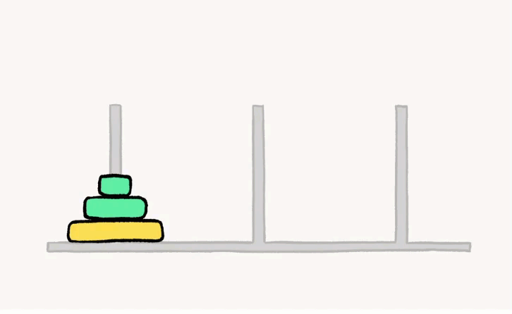

# 递归
## 暴力递归就是尝试
- 把问题转化为规模缩小的同类问题的子问题
- 有明确的不需要继续进行递归的条件（base case）
- 有当得到了子问题的结果之后的决策过程
- 不记录每一个子问题的解

## Hanoi Tower

如下图所示，从左到右有A、B、C三根柱子，其中A柱子上面有从小叠到大的n个圆盘，现要求将A柱子上的圆盘移到C柱子上去， 期间只有一个原则：一次只能移到一个盘子且大盘子不能在小盘子上面，求移动的步骤和移动的次数

实现这个算法可以简单分为三个步骤：

- 把n-1个盘子由A 移到 B；
- 把第n个盘子由 A移到 C；
- 把n-1个盘子由B 移到 C；

# 动态规划 Dynamic Programming
