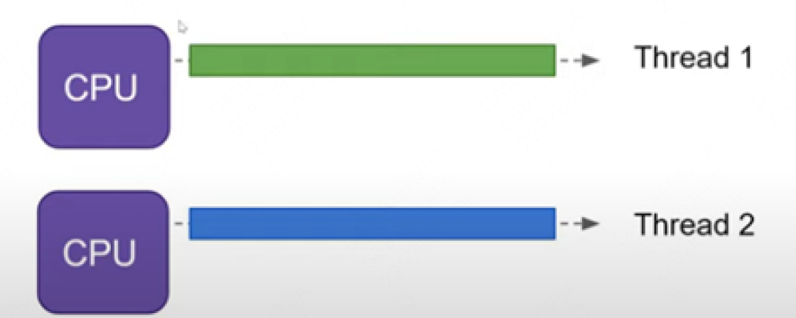
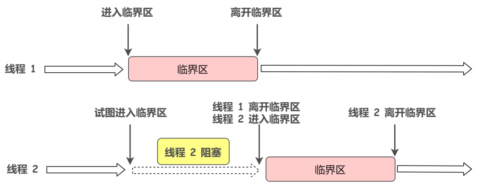
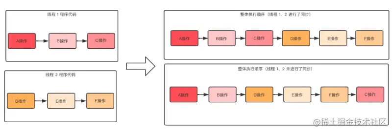
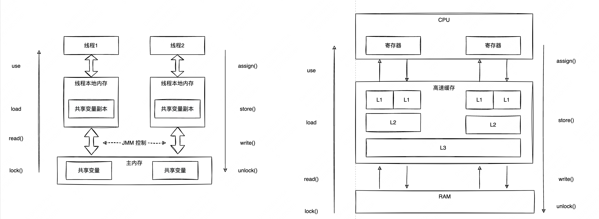
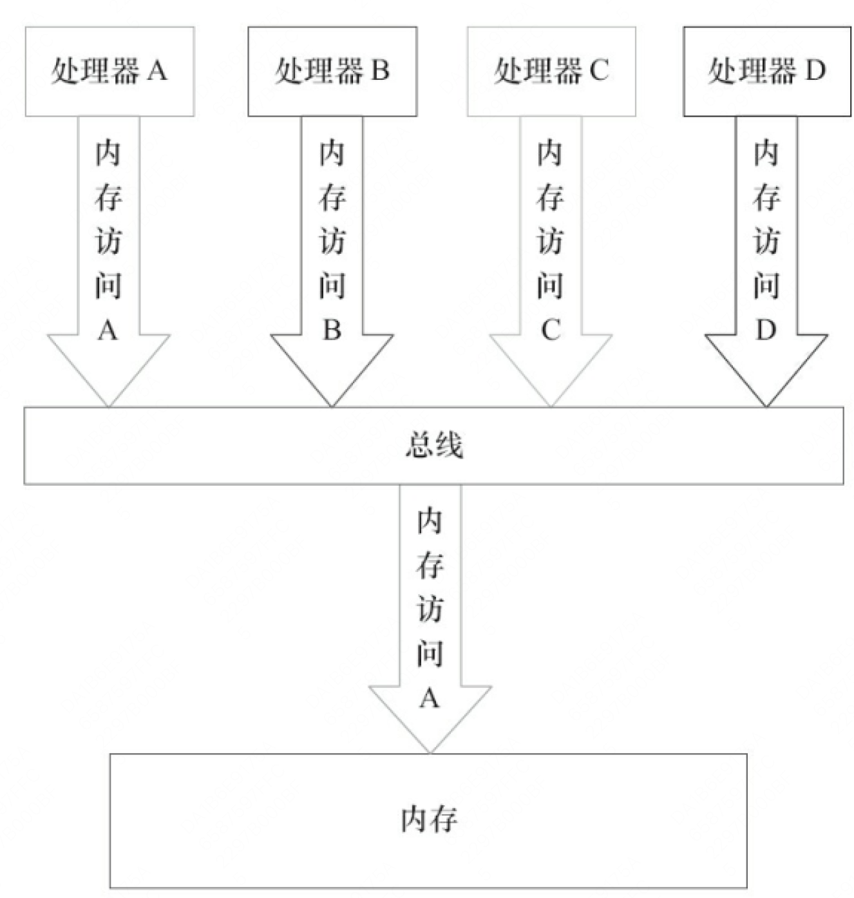

# JMM

## 概念

- 并行与并发
    - 并行(parallel)：指在同一时刻，有多条指令在多个处理器上同时执行。所以无论从微观还是从宏观来看，二者都是一起执行的。
      
    - 指在同一时刻只能有一条指令执行，但多个进程指令被快速的轮换执行，使得在宏观上具有多个进程同时执行的效果，但在微观上并不是同时执行的，只是把时间分成若干段，使多个进程快速交替的执行。
      
- 并发三大特性
    - 可见性：当一个线程修改了共享变量的值，其他线程能够看到修改的值
    - 有序性：即程序执行的顺序按照代码的先后顺序执行。
    - 原子性：一个或多个操作，要么全部执行且在执行过程中不被任何因素打断，要么全部不执行。不采取任何的原子性保障措施的自增操作并不是原子性的。
- 同步与互斥
    - 所谓进程同步就是指协调这些完成某个共同任务的并发线程，在某些位置上指定线程的先后执行次序、传递信号或消息
      
    - 「在一个时间段内只允许一个进程使用的资源」（这也就是互斥的意思），我们将其称为「临界资源」，对临界资源进行访问的那段代码称为「临界区」。
      
- 顺序一致性模型
    - 顺序一致性内存模型是一个被计算机科学家理想化了的理论参考模型，它为程序员提供了极强的内存可见性保证。顺序一致性内存模型有两大特性
        - 一个线程中的所有操作必须按照程序的顺序来执行
        - 所有线程都只能看到一个单一的操作执行顺序。
            - 比如进行了同步，线程1、2看到的执行顺序是 A -> B -> C -> D -> E -> F ，或者 D -> E -> F -> A -> B -> C 不会出现不一致。
            - 如果未进行了同步，那么ABC、DEF的执行顺序整体是有序的，也就是说会遵守 B 或 C 不会在 A 之前执行，但是可能会在 DEF 之前执行，具体看实际的线程获取的CPU时间片的分配。
              
- 指令重排序
    - Java语言规范规定JVM线程内部维持顺序化语义。即只要程序的最终结果与它顺序化情况的结果相等，那么指令的执行顺序可以与代码顺序不一致，此过程叫指令的重排序。
    - 指令重排序的意义：JVM能根据处理器特性（CPU多级缓存系统、多核处理器等）适当的对机器指令进行重排序，使机器指令能更符合CPU的执行特性，最大限度的发挥机器性能。
- CPU 三级缓存
  

### 参考

- [同步与互斥](https://cloud.tencent.com/developer/article/1803377)
- [顺序一致性模型](https://juejin.cn/post/6844903928878858253)

## Java Memory Model JMM

### 定义

JMM规范了Java虚拟机与计算机内存是如何协同工作的：规定了一个线程如何和何时可以看到由其他线程修改过后的共享变量的值，以及在必须时如何同步的访问共享变量。
JMM描述的是一种抽象的概念，一组规则，通过这组规则控制程序中各个变量在共享数据区域和私有数据区域的访问方式，JMM是围绕原子性、有序性、可见性展开的。

- 如果对一个变量执行lock操作，将会清空工作内存中此变量的值，在执行引擎使用这个变量前需要重新执行load或assign操作初始化变量的值
- 对一个变量执行unlock操作之前，必须先把此变量同步到主内存中（执行store和write操作）。

## Volatile

### Volatile 保证可见性

- 当写一个volatile变量时，JMM会把该线程对应的本地内存中的共享变量值刷新到主内存。
- 当读一个volatile变量时，JMM会把该线程对应的本地内存置为无效，线程接下来将从主内存中读取共享变量。

### Volatile 保证指令重排序规则

1. 第二个操作是volatile写，不管第一个操作是什么都不会重排序
2. 第一个操作是volatile读，不管第二个操作是什么都不会重排序
3. 第一个操作是volatile写，第二个操作是volatile读，也不会发生重排序

## 内存屏障

### 内存屏障有两个能力：

1. 阻止屏障两边的指令重排序
2. 刷新处理器缓存/冲刷处理器缓存

### 硬件内存屏障

1. lfence，是一种Load Barrier 读屏障
2. sfence, 是一种Store Barrier 写屏障
3. mfence, 是一种全能型的屏障，具备lfence和sfence的能力
4. Lock前缀，Lock不是一种内存屏障，但是它能完成类似内存屏障的功能。Lock会对CPU总线和高速缓存加锁，可以理解为CPU指令级的一种锁

### JVM层面的内存屏障

- LoadLoad屏障：（指令Load1; LoadLoad; Load2），在Load2及后续读取操作要读取的数据被访问前，保证Load1要读取的数据被读取完毕。
- LoadStore屏障：（指令Load1; LoadStore; Store2），在Store2及后续写入操作被刷出前，保证Load1要读取的数据被读取完毕。
- StoreStore屏障：（指令Store1; StoreStore; Store2），在Store2及后续写入操作执行前，保证Store1的写入操作对其它处理器可见。
- StoreLoad屏障：（指令Store1; StoreLoad; Load2），在Load2及后续所有读取操作执行前，保证Store1的写入对所有处理器可见。
    - 它的开销是四种屏障中最大的。在大多数处理器的实现中，这个屏障是个万能屏障，兼具其它三种内存屏障的功能由于x86只有storeload可能会重排序
    - 所以只有JSR的StoreLoad屏障对应它的mfence或lock前缀指令，其他屏障对应空操作

JMM内存屏障插入策略

1. 在每个volatile写操作的前面插入一个StoreStore屏障
2. 在每个volatile写操作的后面插入一个StoreLoad屏障
3. 在每个volatile读操作的后面插入一个LoadLoad屏障
4. 在每个volatile读操作的后面插入一个LoadStore屏障

x86处理器不会对读-读、读-写和写-写操作做重排序, 会省略掉这3种操作类型对应的内存屏障。仅会对写-读操作做重排序，所以volatile写-读操作只需要在volatile写后插入StoreLoad屏障

## happens-before 原则

happens-before原则非常重要，它是判断数据是否存在竞争、线程是否安全的主要依据。

### happens-before原则定义

1. 如果一个操作happens-before另一个操作，那么第一个操作的执行结果将对第二个操作可见，而且第一个操作的执行顺序排在第二个操作之前。
2. 两个操作之间存在happens-before关系，并不意味着一定要按照happens-before原则制定的顺序来执行。如果重排序之后的执行结果与按照happens-before关系来执行的结果一致，那么这种重排序并不非法。

### happens-before原则规则

1. 程序次序规则：一个线程内，按照代码顺序，书写在前面的操作先行发生于书写在后面的操 作；
2. 锁定规则：一个unLock操作先行发生于后面对同一个锁的lock操作；
3. volatile变量规则：对一个变量的写操作先行发生于后面对这个变量的读操作；
4. 传递规则：如果操作A先行发生于操作B，而操作B又先行发生于操作C，则可以得出操作A先行发生于操作C；
5. 线程启动规则：Thread对象的start()方法先行发生于此线程的每个一个动作；
6. 线程中断规则：对线程interrupt()方法的调用先行发生于被中断线程的代码检测到中断事件的发生；
7. 线程终结规则：线程中所有的操作都先行发生于线程的终止检测，我们可以通过 Thread.join()方法结束、Thread.isAlive()的返回值手段检测到线程已经终止执行；
8. 对象终结规则：一个对象的初始化完成先行发生于他的finalize()方法的开始；

## 缓存一致性

### 缓存一致性要求

- 写传播（Write Propagation）：对任何缓存中的数据的更改都必须传播到对等缓存中的其他副本(该缓存行的副本)。
- 事务串行化（Transaction Serialization）：对单个内存位置的读/写必须被所有处理器以相同的顺序看到。理论上，一致性可以在加载/存储粒度上执行。然而，在实践中，它通常在缓存块的粒度上执行。
- 一致性机制（Coherence mechanisms）
    - 窥探机制（snooping）：每个请求都必须广播到系统中的所有节点，这意味着随着系统变大，(逻辑或物理)总线的大小及其提供的带宽也必须增加；速度快。
    - 基于目录的机制（directory based）：消息是点对点的，而不是广播的。更大的延迟，更小的带宽要求。

### 总线仲裁机制

- 每次处理器和内存之间的数据传递都是通过一系列步骤来完成的，这一系列步骤称之为总线事务（Bus Transaction）。总线事务包括读事务（Read Transaction）和写事务（WriteTransaction）。
- 总线会同步试图并发使用总线的事务。在一个处理器执行总线事务期间，总线会禁止其他的处理器和I/O设备执行内存的读/写。
- 多个处理器同时向总线发起总线事务时，总线仲裁（Bus Arbitration）会对竞争做出裁决。
- 总线的这种工作机制可以把所有处理器对内存的访问以串行化的方式来执行。在任意时间点，最多只能有一个处理器可以访问内存。这个特性确保了单个总线事务之中的内存读/写操作具有原子性。

### 总线窥探

- 当特定数据被多个缓存共享时，处理器修改了共享数据的值，更改必须传播到所有其他具有该数据副本的缓存中。这种更改传播可以防止系统违反缓存一致性。
- 这个动作可以是刷新缓存块或使缓存块失效。它还涉及到缓存块状态的改变，这取决于缓存一致性协议（cache coherence protocol）。

