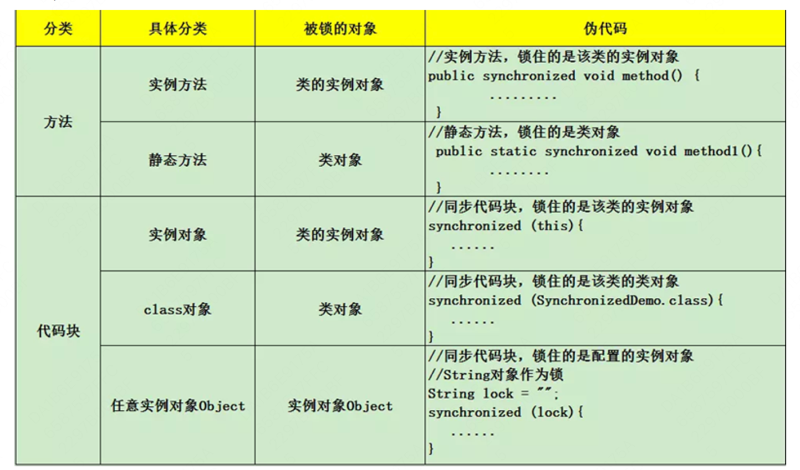
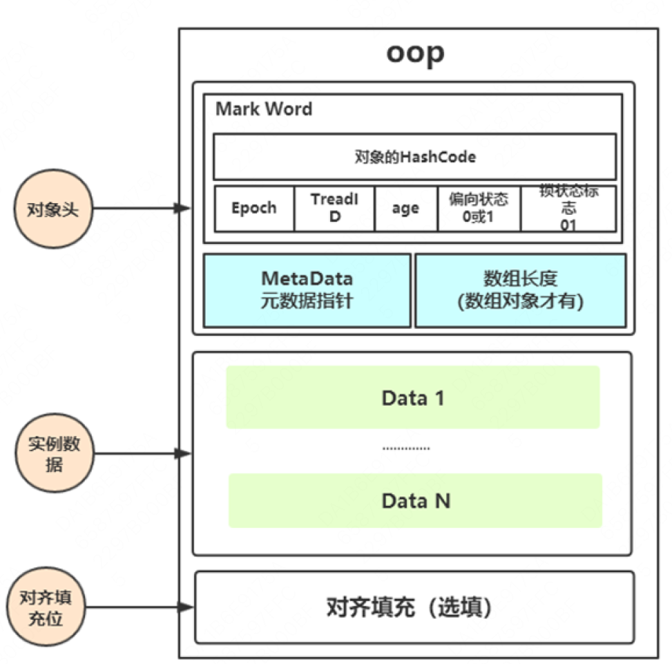
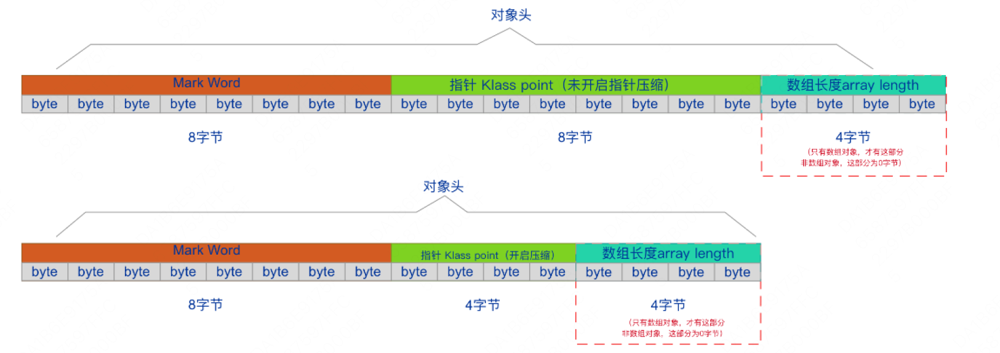
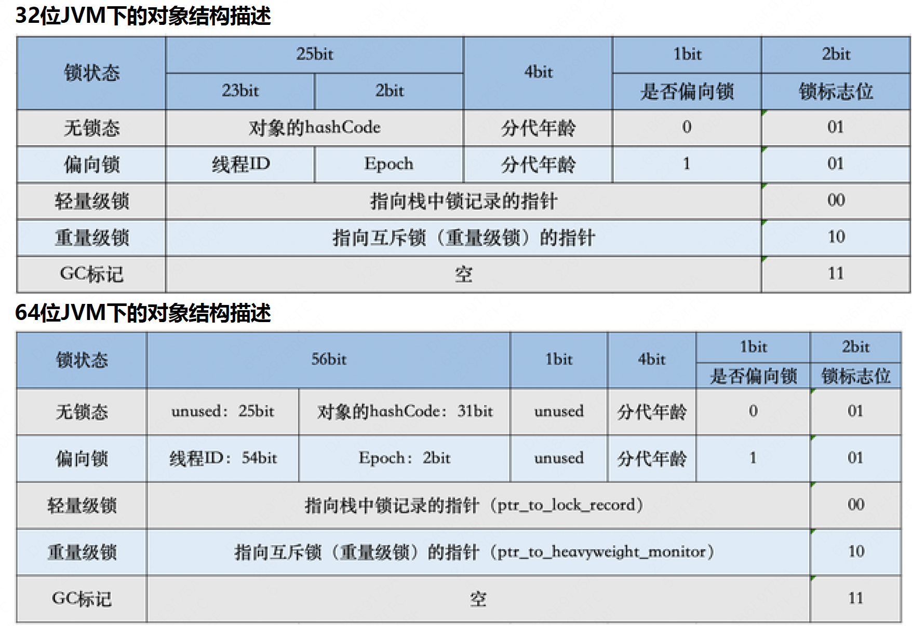
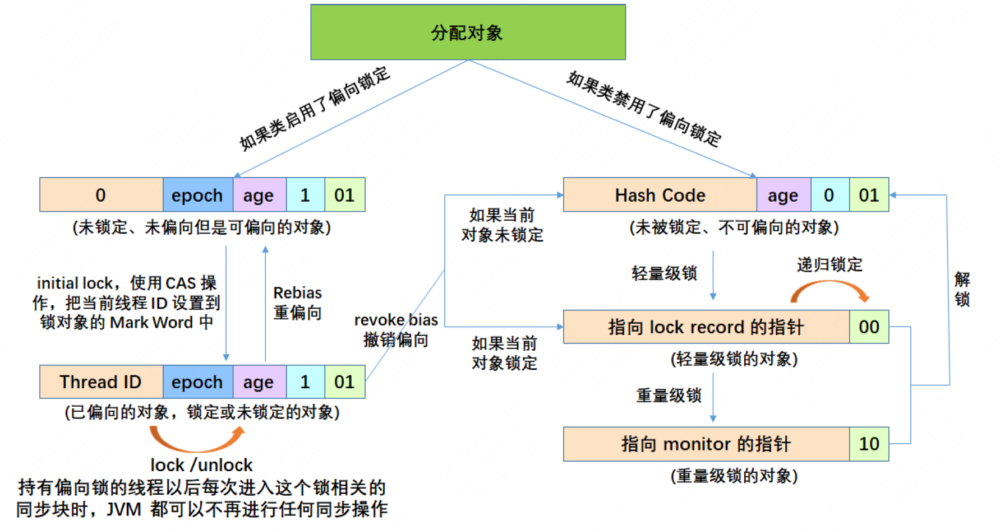

# Synchronized

## Synchronized 使用

synchronized 同步块是 Java 提供的一种原子性内置锁，Java 中的每个对象都可以把它当作一个同步锁来使用。

**加锁方式**


## Synchronized 原理

**synchronized是JVM内置锁，基于Monitor机制实现**

- 同步方法是通过方法中的 access_flags 中设置 ACC_SYNCHRONIZED 标志来实现；
- 同步代码块是通过 monitorenter 和 monitorexit 来实现。两个指令的执行是JVM通过调用操作系统的互斥原语mutex来实现，被阻塞的线程会被挂起、等待重新调度，会导致“用户态和内核态”两个态
  之间来回切换，对性能有较大影响。

## Monitor（管程/监视器）

- 管程是指管理共享变量以及对共享变量操作的过程，让它们支持并发。
- wait() 进入等待队列。
    - 唤醒的时间和获取到锁继续执行的时间是不一致的，被唤醒的线程再次执行时可能条件又不满足了，所以循环检验条件。
    - wait()方法还有一个超时参数，为了避免线程进入等待 队列永久阻塞。

```java
synchronized (obj){
      while(<condition does not hold>)
      obj.wait(timeout);
      ... // Perform action appropriate to condition
      }
```

- notify()/notifyAll() 唤醒队列

### Monitor 的 Java 实现

- java.lang.Object 类定义了 wait()，notify()，notifyAll() 方法，这些方法的具体实现，依赖于 ObjectMonitor 实现，这是 JVM 内部基于 C++ 实现的一套机制。

```java
ObjectMonitor(){
      _recursions=0; // 锁的重入次数
      _object=NULL; //存储锁对象
      _owner=NULL; // 标识拥有该monitor的线程（当前获取锁的线程）
      _WaitSet=NULL; // 等待线程（调用wait）组成的双向循环链表，_WaitSet是第一个节点
      _cxq=NULL; //多线程竞争锁会先存到这个单向链表中 （FILO栈结构）
      _EntryList=NULL; //存放在进入或重新进入时被阻塞(blocked)的线程 (也是存竞争锁失败的线程)
      }
```

- 在获取锁时，是将当前线程插入到cxq的头部，而释放锁时，默认策略是：如果EntryList为空，则将cxq中的元素按原有顺序插入到EntryList，并唤醒第一个线程，也就是当EntryList 为空时，是后来的线程先获取锁。_
  EntryList不为空，直接从_EntryList中唤醒线程。
  

## 对象的内存布局

- 对象头：比如 hash码，对象所属的年代，对象锁，锁状态标志，偏向锁（线程）ID，偏向时间，数组长度（数组对象才有）等。
- 实例数据：存放类的属性数据信息，包括父类的属性信息；
- 对齐填充：由于虚拟机要求 对象起始地址必须是8字节的整数倍。填充数据不是必须存在的，仅仅是为了字节对齐。
  

### 对象头



- Mark Word
    - 用于存储对象自身的运行时数据，如哈希码（HashCode）、GC分代年龄、锁状态标志、线程持有的锁、偏向线程ID、偏向时间戳等，
    - 这部分数据的长度在32位和64位的虚拟机中分别为32bit和64bit，官方称它为“Mark Word”。
- Klass Pointer
    - 对象头的另外一部分是klass类型指针，即对象指向它的类元数据的指针，虚拟机通过这个指针来确定这个对象是哪个类的实例。
    - 32位4字节，64位开启指针压缩或最大堆内存<32g时4字节，否则8字节。jdk1.8默认开启指针压缩后为4字节，当在JVM参数中关闭指针压缩（-XX:-UseCompressedOops）后，长度为8字节。
- 数组长度（只有数组对象有）
    - 如果对象是一个数组, 那在对象头中还必须有一块数据用于记录数组长度。4字节

### Mark Word



- hash：保存对象的哈希码。运行期间调用System.identityHashCode()来计算，延迟计算，并把结果赋值到这里。
- age：保存对象的分代年龄。表示对象被GC的次数，当该次数到达阈值(默认15)的时候，对象就会转移到老年代。
- **biased_lock：偏向锁标识位。由于无锁和偏向锁的锁标识都是 01，没办法区分，这 里引入一位的偏向锁标识位。**
- **lock：锁状态标识位。区分锁状态，比如11时表示对象待GC回收状态, 只有最后2位锁标识(11)有效。**
- JavaThread： 保存持有偏向锁的线程ID。
    - 偏向模式的时候，当某个线程持有对象的时候，对象这里就会被置为该线程的ID。在后面的操作中，就无需再进行尝试获取锁的动作。
    - 这个线程ID并不是JVM分配的线程ID号，和Java Thread中的ID是两个概念。
- epoch： 保存偏向时间戳。偏向锁在CAS锁操作过程中，偏向性标识，表示对象更偏 向哪个锁。
- ptr_to_heavyweight_monitor：重量级锁状态下，指向对象监视器Monitor的指针。
- ptr_to_lock_record：轻量级锁状态下，指向栈中锁记录的指针。

## Synchronized 优化

### 偏向锁

- 偏向锁是一种针对加锁操作的优化手段，在大多数情况下，锁不仅不存在多线程竞争，而且总是由同一线程多次获得，因此为了消除数据在无竞争情况下锁重入（CAS操作）的开销而引入偏向锁。
- JVM 默认开启偏向锁模式，新创建对象的Mark Word中偏向锁标识位为 1，Thread Id为0， 说明此时处于可偏向但未偏向任何线程，也叫做匿名偏向状态(anonymously biased)。
- 偏向锁延迟偏向：偏向锁模式存在偏向锁延迟机制：HotSpot 虚拟机在启动后有个 4s 的延迟才会对每个新建的对象开启偏向锁模式。
- ‐XX:BiasedLockingStartupDelay=0 //关闭延迟开启偏向锁
- ‐XX:‐UseBiasedLocking //禁止偏向锁
- ‐XX:+UseBiasedLocking //启用偏向锁

#### 偏向锁撤销

##### 调用HashCode

- 偏向锁不会记录 hashCode
- 无锁状态在 MarkWord 中记录 hashCode
- 轻量级锁会在锁记录中记录 hashCode
- 重量级锁会在 ObjectMonitor 中记录 hashCode
- 当对象处于可偏向（也就是线程ID为0）和已偏向的状态下，调用HashCode计算将会使对象再也无法偏向
    - 当对象可偏向时，MarkWord 将变成未锁定状态，如果出现锁竞争只能升级成轻量锁。
    - 当对象正处于偏向锁时，调用HashCode将使偏向锁强制升级成重量锁。

##### 调用 wait() / notify()

- 偏向锁状态执行obj.notify() 会升级为轻量级锁
- 偏向锁状态调用obj.wait(timeout) 会升级为重量级锁，wait() 会使线程挂起，内核态与用户态的转换

#### 偏向锁批量重偏向&批量撤销

- 批量重偏向（bulk rebias）机制是为了解决：一个线程创建了大量对象并执行了初始的同步操作，后来另一个线程也来将这些对象作为锁对象进行操作，这样会导致大量的偏向锁撤销操作。
- 批量撤销（bulk revoke）机制是为了解决：在明显多线程竞争剧烈的场景下使用偏向锁是不合适的。
- 总结：
    - 批量重偏向和批量撤销是针对类的优化，和对象无关。
    - 偏向锁重偏向一次之后不可再次重偏向。
    - 当某个类已经触发批量撤销机制后，JVM会默认当前类产生了严重的问题，剥夺了该类的新实例对象使用偏向锁的权利

### 轻量级锁

- 轻量级锁所适应的场景是线程交替执行同步块的场合，如果存在同一时间多个线程访问同一把锁的场合，就会导致轻量级锁膨胀为重量级锁。
- 轻量级锁只能降级到无锁状态，不能降级到偏向锁状态。

### 锁对象状态转换 - 总结



### 自适应自旋 - 重量级锁

- 重量级锁竞争的时候，使用自适应自旋来进行优化，如果当前线程通过自旋获取锁成功，则当前线程就可以避免阻塞。
- 自旋的目的是为了减少线程挂起的次数，尽量避免直接挂起线程

### 锁粗化

- 如果JVM检测到有一连串零碎的操作都是对同一对象的加锁，将会扩大加锁同步的范围（即锁粗化）到整个操作序列的外部。例如加锁操作是出现在循环体中的。

```java
public class demo {

    StringBuffer buffer = new StringBuffer();

    /**
     * 锁粗化
     */
    public void append() {
        buffer.append("aaa").append(" bbb").append(" ccc");
    }
}
```

### 锁消除

- 锁消除是Java虚拟机在JIT编译期间，通过对运行上下文的扫描，去除不可能存在共享资源竞争的锁，通过锁消除，可以节省毫无意义的请求锁时间。

```java

public class demo {

    /**
     * 锁消除
     * ‐XX:+EliminateLocks 开启锁消除(jdk8默认开启）
     * ‐XX:‐EliminateLocks 关闭锁消除
     */
    public static void main(String[] args) {
        for (int i = 0; i < 10; i++) {
            new Thread(() -> {
                StringBuffer buffer = new StringBuffer();
                buffer.append("aaa").append(" bbb").append(" ccc");
            }).start();
        }
    }
}

```