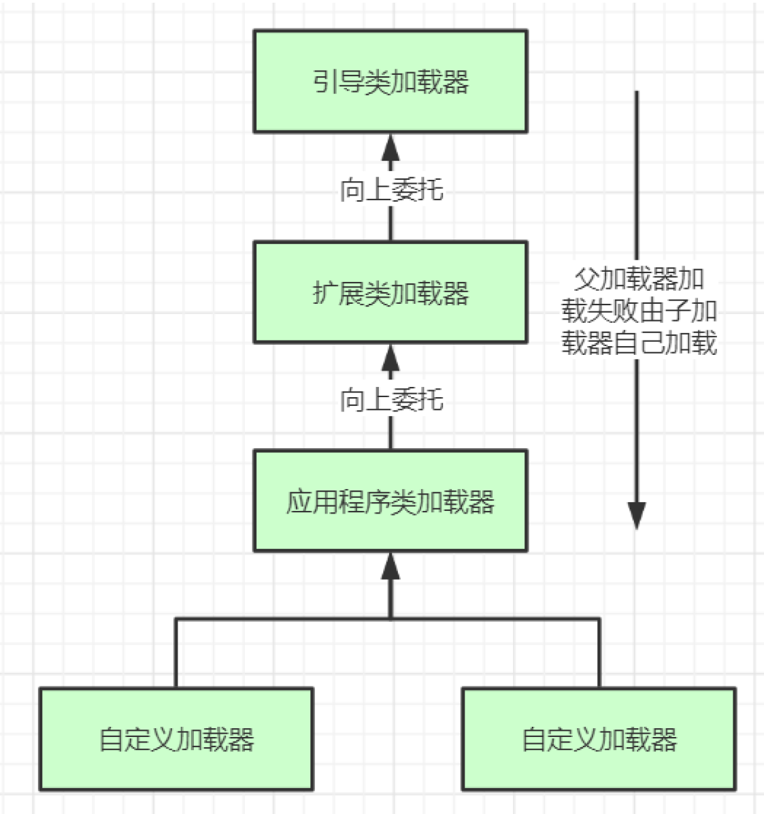

# 类加载

## 类加载全过程

- 首先通过双亲委派机制找到具体要加载类的类加载实例
    - 双亲委派机制
    - 类加载器初始化过程
- 然后，类加载实例通过 加载 --> 验证 --> 准备 --> 解析 --> 初始化 五个步骤，将类加载到方法区

### Java 中主要类加载器

- 引导类加载器：负责加载支撑JVM运行的位于JRE的lib目录下的核心类库，比如rt.jar、charsets.jar等
- 扩展类加载器：负责加载支撑JVM运行的位于JRE的lib目录下的ext扩展目录中的JAR类包
- 应用程序类加载器：负责加载ClassPath路径下的类包，主要就是加载你自己写的那些类
- 自定义加载器：负责加载用户自定义路径下的类包

### 类加载器初始化

- 创建JVM启动器实例sun.misc.Launcher. sun.misc.Launcher初始化使用了单例模式设计，保证一个JVM虚拟机内只有一个 sun.misc.Launcher 实例
- 在Launcher构造方法内部，其创建了两个类加载器，分别是 sun.misc.Launcher.ExtClassLoader(扩展类加载器) 和sun.misc.Launcher.AppClassLoader(应用类加载器).
  引导类加载器是JVM内部使用C++实现的。
- JVM默认使用Launcher的getClassLoader()方法返回的类加载器AppClassLoader的实例加载我们的应用程序。

### 类加载主要逻辑 - 双亲委派

- ExtClassLoader 、 AppClassLoader 、自定义类加载器公共抽象类 ClassLoader 实现了 classLoader()、findClass() 方法是类加载的核心逻辑
- 自定义类加载器重写 findClass() 方法从指定的路径下加载类。如果要打破双亲委派机制，可以重写 classLoader() 方法，不委派给父加载器加载。（注意：核心库不允许自定义加载器加载）
- 加载某个类时会先委托父加载器寻找目标类，找不到再委托上层父加载器加载，如果所有父加载器在自己的加载类路径下都找不到目标类，则再逐层下沉到自己的类加载路径中查找并载入目标类。
- 主要步骤：
    1. 首先，检查一下指定名称的类是否已经加载过，如果加载过了，就不需要再加载，直接返回。
    2. 如果此类没有加载过，那么，再判断一下是否有父加载器；如果有父加载器，则由父加载器加载（即调用parent.loadClass(name, false);）.或者是调用bootstrap类加载器来加载。
    3. 如果父加载器及bootstrap类加载器都没有找到指定的类，那么调用当前类加载器的 findClass方法来完成类加载。

```java
public abstract class ClassLoader {

    // 父加载类
    private final ClassLoader parent;

    // The classes loaded by this class loader. 
    // 它的唯一目的是如果 fullGC 要清理方法区中的 class 对象，必须先清理 class 对象的加载器
    private final Vector<Class<?>> classes = new Vector<>();

    protected Class<?> findClass(String name) throws ClassNotFoundException {
        throw new ClassNotFoundException(name);
    }

    protected Class<?> loadClass(String name, boolean resolve) throws ClassNotFoundException {
        // 一个 className 一个 锁
        synchronized (getClassLoadingLock(name)) {
            // First, check if the class has already been loaded
            Class<?> c = findLoadedClass(name);
            if (c == null) {
                long t0 = System.nanoTime();
                try {
                    // 父加载器，如果自定义类加载器打破双亲委派机制，重写 loadClass() 方法，去掉这块的逻辑，直接使用重写的 findClass() 方法加载
                    if (parent != null) {
                        c = parent.loadClass(name, false);
                    } else {
                        c = findBootstrapClassOrNull(name);
                    }
                } catch (ClassNotFoundException e) {
                    // ClassNotFoundException thrown if class not found
                    // from the non-null parent class loader
                }

                if (c == null) {
                    // If still not found, then invoke findClass in order
                    // to find the class.
                    long t1 = System.nanoTime();
                    c = findClass(name);

                    // this is the defining class loader; record the stats
                    sun.misc.PerfCounter.getParentDelegationTime().addTime(t1 - t0);
                    sun.misc.PerfCounter.getFindClassTime().addElapsedTimeFrom(t1);
                    sun.misc.PerfCounter.getFindClasses().increment();
                }
            }
            if (resolve) {
                resolveClass(c);
            }
            return c;
        }
    }

}
```

### 为什么要设计双亲委派机制

- 沙箱安全机制：禁止核心库使用自定义加载器加载，例如自己写的java.lang.String.class类不会被加载，这样便可以防止核心 API 库被随意篡改。
- 避免类的重复加载：当父亲已经加载了该类时，就没有必要子ClassLoader再加载一 次，保证被加载类的唯一性



### 加载步骤

- 加载：在硬盘上查找并通过IO读入字节码文件，**使用到类时才会加载**
    - 在加载阶段会在内存中生成一个代表这个类的 java.lang.Class 对象，作为方法区这个类的各种数据的访问入口
- 验证：校验字节码文件的正确性
- 准备：给类的静态变量分配内存，并赋予默认值
- 解析：将符号引用替换为直接引用，该阶段会把一些静态方法(符号引用，比如 main()方法)替换为指向数据所存内存的指针或句柄等(直接引用)，这是所谓的静态链接过程。
    - 动态链接是在程序运行期间完成的将符号引用替换为直接引用。
- 初始化：对类的静态变量初始化为指定的值，执行静态代码块
- 注意：
    - 类被加载到方法区中后主要包含运行时常量池、类型信息、字段信息、方法信息、类加载器的引用、对应class实例的引用等信息。
    - 类加载器的引用：这个类到类加载器实例的引用
    - 对应class实例的引用：类加载器在加载类信息放到方法区中后，会创建一个对应的Class 类型的 对象实例放到堆(Heap)中, 作为开发人员访问方法区中类定义的入口和切入点。