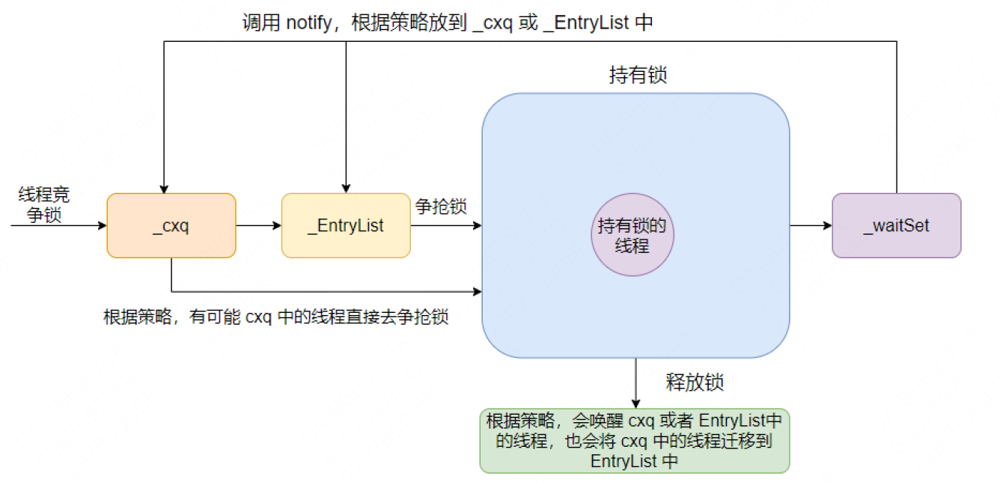

# Java 总结
## synchronized 和 ReentrantLock 的区别

## 相同点

- 都是在多个线程对共享资源读写操作时，通过线程阻塞的方式避免发生指令交错(线程安全问题)
    - 阻塞式：synchronized & lock
    - 非阻塞式：原子变量(cas)
- 都是同一时刻只允许一个线程获取锁，未获取到锁的线程通过调用 park() 方法把线程挂起，并且添加到等待队列中等待被唤醒， 通过调用 unpark() 方法被唤醒
- 都会实现同步等待队列和条件等待队列，线程竞争获取锁失败会进入同步等待队列，线程主动被挂起后进入条件等待队列。不过具体实现方式不同。

## 使用方式不同

- synchronized 是关键字，可以作用于方法、代码块，被锁的对象可以是类对象、类的实例对象或者任意的对象。ReentrantLock 是类对象，需要实例化后使用。
- synchronized 获取锁后执行成功或异常都不需要手动释放锁。ReentrantLock 需要在 finally 里手动释放锁。
- synchronized 锁状态是无法在代码中直接判断的。ReentrantLock 可以通过 ReentrantLock#isLocked 判断。
- ReentrantLock 获取锁的形式有多种：如立即返回是否成功的 tryLock(), 以及等待指定时长的获取，更加灵活。
- ReentrantLock 可以通过 ReentrantLock#lockInterruptibly 方法是被中断。synchronized 不可以被中断。

## 实现原理不同

- synchronized 是 JVM 层次的锁实现，基于 Monitor(管程) 实现。synchronized 被锁对象膨胀为重量级锁的时候会给被锁对象创建一个 ObjectMonitor 对象，通过 ObjectMonitor::
  enter 方法获取锁；通过 ObjectMonitor::exit 方法释放锁。
- ReentrantLock 是 JDK 层次的锁实现，通过实现 AbstractQueuedSynchronizer 抽象同步框架的 tryAcquire() 方法实现加锁，tryRelease() 方法实现解锁。
- synchronized 通过锁对象 MarkWord 中的偏向锁标记位和锁标记位来标记锁的状态，包括：偏向锁 101，无锁 001，轻量级锁 00，重量级锁 10
- ReentrantLock 通过实例对象的属性 volatile int state 来标记锁状态，state == 0 是无锁状态，state == 1 是加锁状态
- JVM内置锁在1.5之后版本做了重大的 优化，如锁粗化（Lock Coarsening）、锁消除（Lock Elimination）、轻量级锁（Lightweight Locking）、偏向锁（Biased
  Locking）、自适应自旋（Adaptive Spinning）等技术来减少锁操作的开销，并发线程较少时内置锁的并发性能已经基本与Lock持平。

## 锁的公平性不同

- synchronized 是非公平锁，是其同步等待队列和条件等待队列实现方式和等待唤醒机制决定的。
- ReentrantLock 是可以是公平也可以是非公平的。
    - 非公平锁，当线程尝试获取锁时，先调用 compareAndSetState() 尝试能不能获取锁 ，如果获取成功则直接拿到锁，如果获取失败则加入等待队列。
    - 公平锁，当线程尝试获取锁时，判断等待队列中是否存在等待锁的线程，如果有直接进入等待队列。如果没有才尝试获取锁。

## 同步等待队列和条件等待队列实现方式不同

- synchronized 同步等待队列 cxq 是单向队列，先入后出。只有一个条件等待队列 wait_set，调用 wait() 将线程挂起并加入到 wait_set 尾部。调用 notify()/notifyAll() 唤起线程。
    - 在获取锁时，是将当前线程插入到cxq的头部，而释放锁时，默认策略是：如果EntryList为空，则将cxq中的元素按原有顺序插入到EntryList，并唤醒第一个线程，也就是当EntryList 为空时，是后来的线程先获取锁。_
      EntryList不为空，直接从_EntryList中唤醒线程。
      
- ReentrantLock 同步等待队列是双向链表，先入先出。可以有多个等待队列，通过 await() 方法加入条件等待队列，signal()/signalAll() 方法唤醒线程。
  

# 死锁
