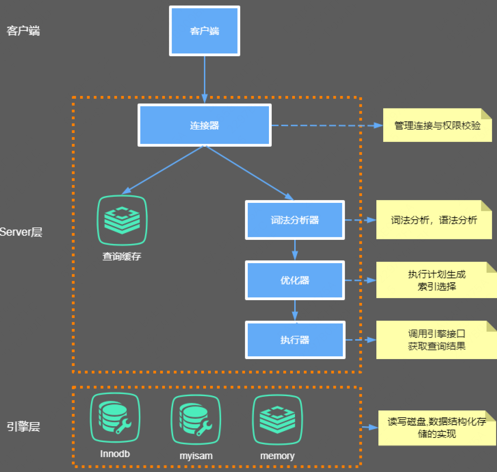

[TOC]

# MySQL 各组件简介

## Server 层

### 连接器

- 连接器负责跟客户端建立连接、获取权限、维持和管理连接。首先完成经典的 TCP 握手，然后连接器根据 user & password 认证你的身份。用户名密码认证通过，连接器会到权限表里面查出你拥有的权限。
- **连接里每次请求的权限判断逻辑都依赖于最初读到的权限**
  - 用户名密码认证通过，连接器会到权限表里面查出你拥有的权限。之后，这个连接里面的权限判断逻辑，都将依赖于此时读到的权限。因此一个用户成功建立连接后，即使你用管理员账号对这个用户的权限做了修改，也不会影响已经存在连接的权限。修改完成后，只有新建的连接才会使用新的权限设置。
  - **wait_timeout** : 客户端如果长时间不发送command到Server端，连接器就会自动将它断开。这个时间是由参数 wait_timeout 控制的，默认值是 8 小时。
- **长链接 & 短连接**
  - **长连接 **是指连接成功后，如果客户端持续有请求，则一直使用同一个连接。
  - **短连接** 是指每次执行完很少的几次查询就断开连接，下次查询再重新建立一个。
  - **长链接导致 OOM **: 开发当中我们大多数时候用的都是长连接,把连接放在Pool内进行管理，但是长连接有些时候会导致 MySQL 占用内存涨得特别快，这是因为 MySQL 在执行过程中临时使用的内存是管理在连接对象里面的，这些资源会在连接断开的时候才释放。可能导致内存占用太大，被系统强行杀掉（OOM），从现象看就是 MySQL 异常重启了。
  - 长链接占用内存过高问题如何解决？
    - 定期断开长连接。使用一段时间，或者程序里面判断执行过一个占用内存的大查询后，断开连接，之后要查询再重连。
    - 如果你用的是 MySQL 5.7 或更新版本，可以在每次执行一个比较大的操作后，通过执行 mysql_reset_connection 来重新初始化连接资源。这个过程不需要重连和重新做权限验证，但是会将连接恢复到刚刚创建完时的状态。

### 查询缓存

- MySQL 拿到一个查询请求后，会先到查询缓存看看，之前是不是执行过这条语句。之前执行过的语句及其结果可能会以 key-value 对的形式，被直接缓存在内存中。key 是查询的语句，value 是查询的结果。如果你的查询能够直接在这个缓存中找到 key，那么这个 value 就会被直接返回给客户端。

- **大多数情况查询缓存就是个鸡肋，为什么呢？**

  因为查询缓存往往弊大于利。查询缓存的失效非常频繁，只要有对一个表的更新，这个表上所有的查询缓存都会被清空。因此很可能你费劲地把结果存起来，还没使用呢，就被一个更新全清空了。对于更新压力大的数据库来说，查询缓存的命中率会非常低。

- **mysql 8.0已经移除了查询缓存功能**

### 分析器

- 分析器，要让 MySQL 知道你要做什么了
- 分析器执行逻辑：词法分析、语法分析、语义分析、构造执行树、生成执行计划、计划的执行

### 优化器

- 分析器分析完成后给出两种或多种执行方案，每种执行方案的逻辑结果是一样的，但是执行的效率会有不同，优化器的作用就是决定选择使用哪一个方案。
- 选择使用哪个索引。

### 执行器

- 开始执行的时候，要先判断一下你对这个表有没有执行查询的权限，如果没有，就会返回没有权限的错误
- 如果有权限，就打开表继续执行。打开表的时候，执行器就会根据表的引擎定义，去使用这个引擎提供的接口。

# 一条 SQL 是如何执行的

1. 从磁盘中查询数据，读取磁盘的数据是以 page 为单位，最少读取 1 个 page 的数据
2. 记录回滚日志，写入旧值便于回滚
3. 更新内存，更新 buffer pool 中的数据
4. 写 redo 日志
5. 准备提交事务， redo 日志写入磁盘
6. 准备提交事务，binlog 日志写入磁盘
7. 写入 commit 记录到 redo 文件，标记事务已提交，该标记为了保证 redo log 和 bin log 数据一致
8. 随机写入磁盘，以 page 为单位写入磁盘

**注意**

- 所有写磁盘的操作都在独立的 IO 写盘线程中进行的，其他任何操作都是操作 buffer pool 
- Undo log ：如果事务执行失败要回滚数据，用到 undo log 里的数据；恢复的是 buffer pool 里缓存的数据
- Redo log ：如果事务提交成功了，buffer pool 中的数据还没来得及写入磁盘，这时候 MySQL 宕机了，可以用 redo log 中的日志恢复 buffer pool 中的数据
- bin log ：主要用来恢复数据库磁盘里的数据
