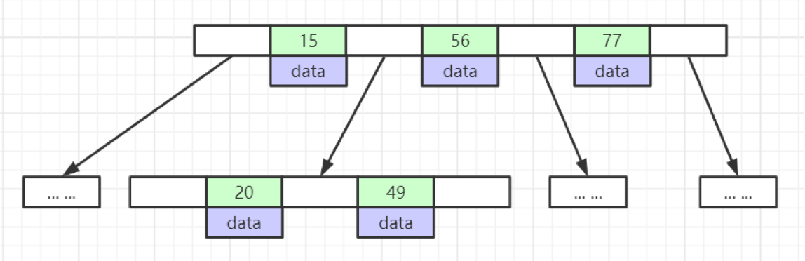
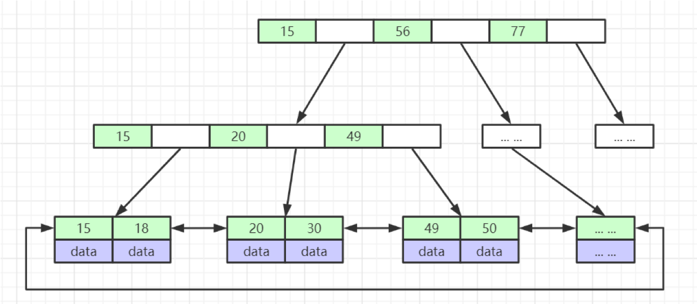
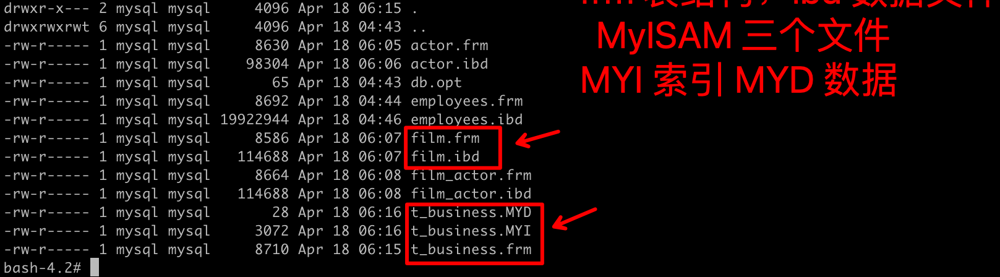
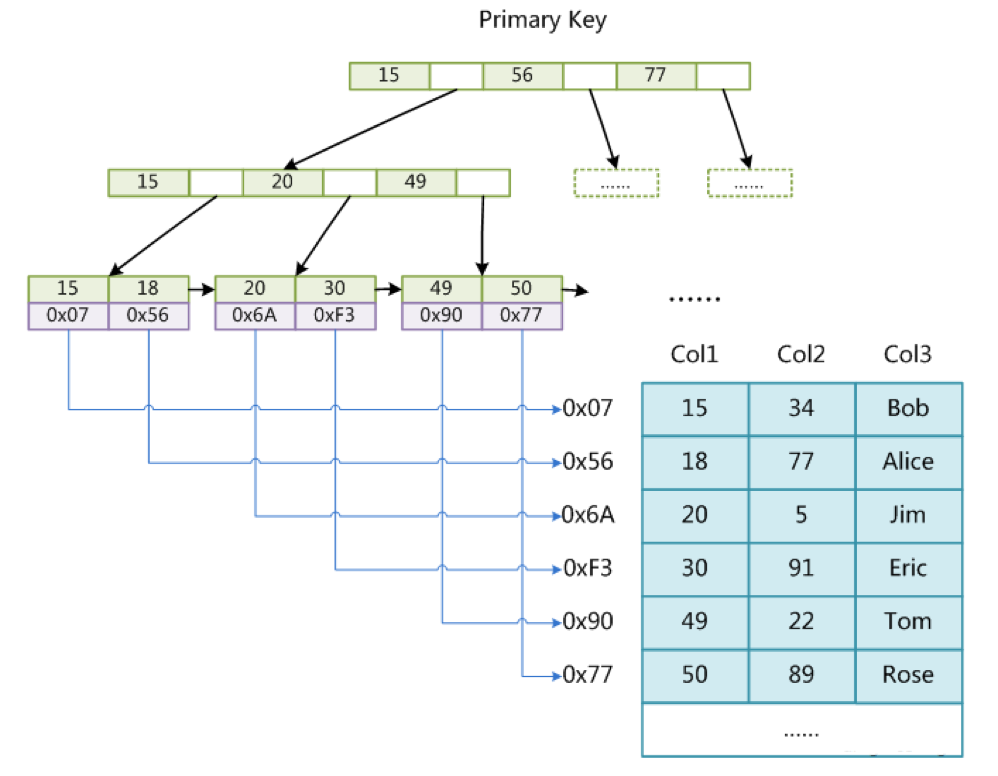
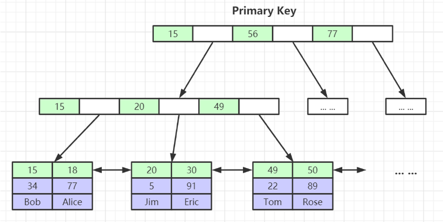
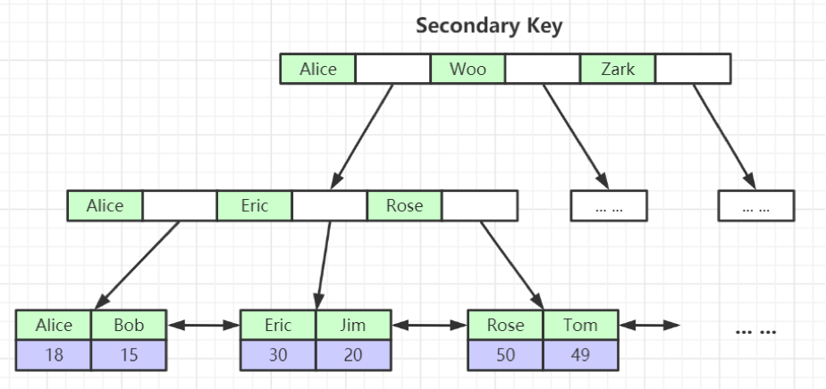

[TOC]

# MySQL 索引是什么

- 索引是帮助MySQL高效获取数据的排好序的数据结构

# 索引的数据结构

- 二叉树
- 红黑树
- Hash表
- B-Tree

## B 树 与 B+ 树区别（MySQL 索引为什么选择 B+ 树）

- B+ 树非叶子节点不存储数据，只存储冗余索引，叶子节点包含所有的索引字段；B 树非叶子节点也存数据

- B+ 树叶子节点之间用指针链接。B 树叶子节点的指针为空。

- B 树和 B+ 树，节点中的数据索引从左到右递增排列；所有叶子节点有相同的高度；

  B 树：

​	B+ 树

 **MySQL 索引为什么选择 B+ 树** 

- 对于非叶子节点，相同大小的存储片，B+ 树可以存储更多的索引；所以相同的高度，B+ 树可以存储更多的数据；MySQL 查询的时最耗时的是磁盘IO，树高一层，就多一层磁盘IO
- B+ 树叶子节点之间用指针链接，对于范围查找效率更高；通过指针就可以找到下一个存储片的数据，不需要再回到树的根再次查找。

# 聚集索引 & 非聚集索引

- 聚集索引，索引的叶子节点包含所有的数据
- 非聚集索引，索引的叶子节点中所存的数据只是主键索引的值，不是所有的数据

# MyISAM & InnoDB 引擎

## MyISAM 

- 数据文件和索引文件是分离的，所以MyISAM 的索引都是非聚集索引

## InnoDB 

- 数据文件和索引文件是在一起的，InnoDB 中有且只有一个主键索引是聚集索引，其余二级索引都是非聚集索引

## 为什么建议InnoDB表必须建主键，并且推荐使用整型的自增主键？

- InnoDB 需要维护一个聚集索引，如果有主键，则会以主键作为聚集索引；如果没有主键，MySQL 从查找是唯一值的列作为主键，如果没有找到任何唯一值列，则会自己创建一个隐藏列 row_id 作为主键，并给 row_id 设置为唯一的聚集索引。为了减少 MySQL 的自己选择的开销，也为了方便后续查询和扩展，建议必须设置主键。
- 为了减少对主键排序的开销，避免随机值作为主键插入表时引起的聚集索引树结构的调整带来的开销，所以推荐使用整型自增主键；不建议使用 UUID 或 string 类型的主键。

## 为什么非主键索引结构叶子节点存储的是主键值？

- 只保存一份完整的数据，避免多份数据引起的数据不一致的问题
- 只保存一份完整的数据，节省空间

## InnoDB 联合索引-最左前缀原则

- 当你创建了一个联合索引，该索引的任何最左前缀都可以用于查询。比如当你有一个联合索引 ` (col1, col2, col3)`，该索引的所有前缀为 `(col1)`、`(col1, col2)`、`(col1, col2, col3)`，包含这些列的所有查询都会使用该索引进行查询。

# 扩展

## 一个表最多多少个索引，多少列

**InnoDB 引擎**

> A table can contain a maximum of 1017 columns (raised in MySQL 5.6.9 from the earlier limit of 1000). Virtual generated columns are included in this limit.
> A table can contain a maximum of 64 secondary indexes.

- 1个表最大只能 1017 列
- 1个表最大只能创建 64 个 2级索引。 加上主键，那么上面的问题就有了答案，65个
-  复合索引最多只能 16 列

**官方文档**

https://dev.mysql.com/doc/refman/5.7/en/column-count-limit.html#column-count-limits
https://dev.mysql.com/doc/refman/5.7/en/innodb-limits.html

