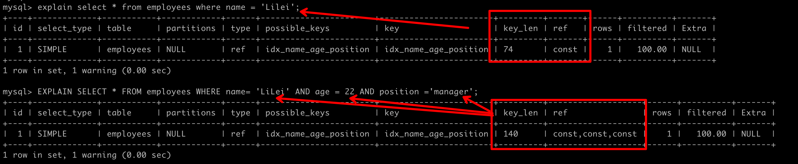
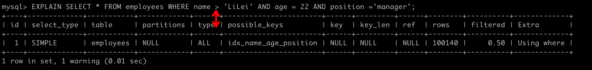
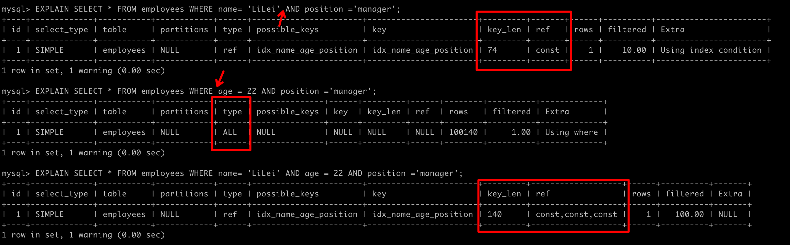
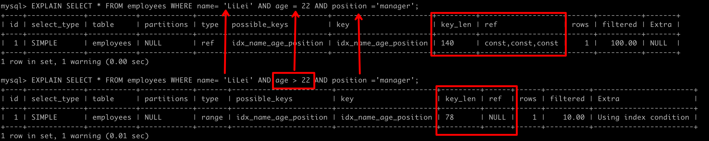
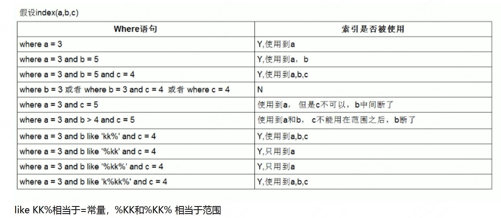
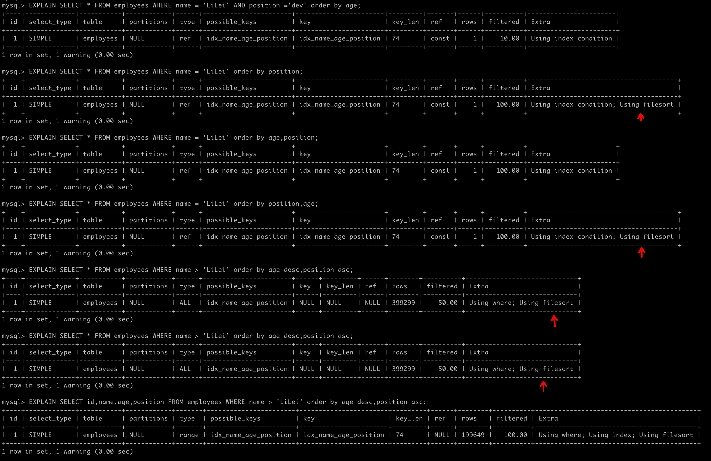
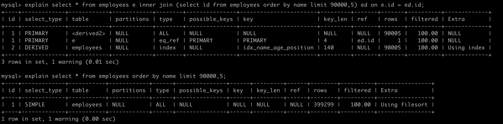
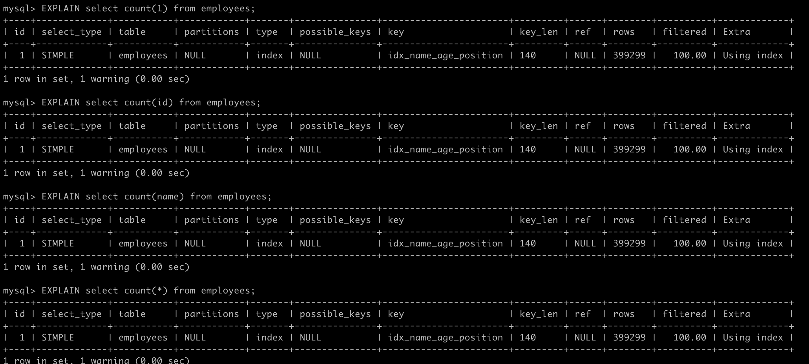
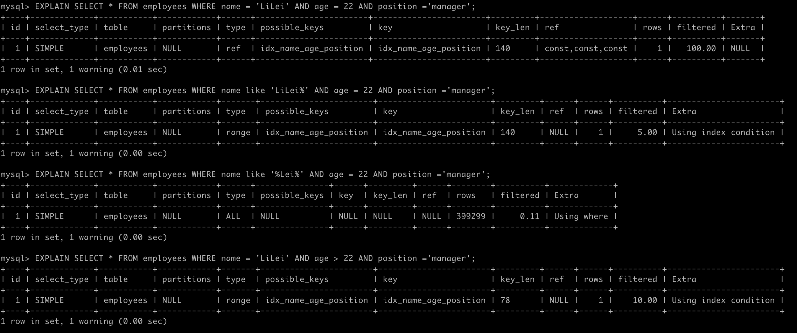
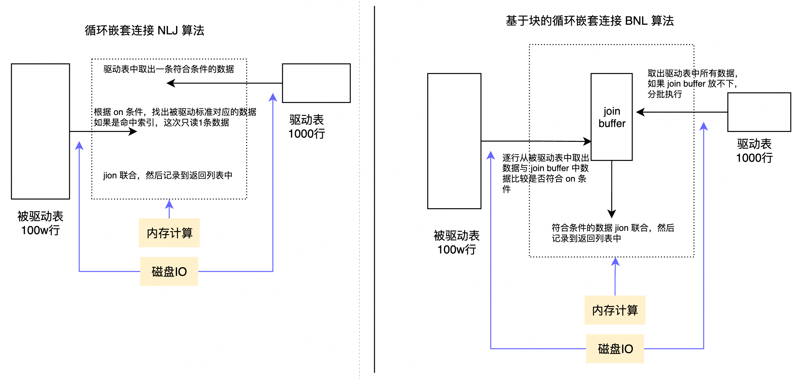

[TOC]

# 前言

请先阅读 [explain](./docs/C_mysql/7_explain.md)

以下的例子创建表语句:

```
 CREATE TABLE `employees` (
 `id` int(11) NOT NULL AUTO_INCREMENT,
 `name` varchar(24) NOT NULL DEFAULT '' COMMENT '姓名',
 `age` int(11) NOT NULL DEFAULT '0' COMMENT '年龄',
 `position` varchar(20) NOT NULL DEFAULT '' COMMENT '职位',
 `hire_time` timestamp NOT NULL DEFAULT CURRENT_TIMESTAMP COMMENT '入职时间',
 PRIMARY KEY (`id`),
 KEY `idx_name_age_position` (`name`,`age`,`position`) USING BTREE
 ) ENGINE=InnoDB AUTO_INCREMENT=1 DEFAULT CHARSET=utf8 COMMENT='员工记录表';
```

InnoDB 引擎，主键 `id` 单调递增 - 聚集索引，`name`,`age`,`position` 联合索引

# 如何设置索引

## 索引最佳实践

- **全值匹配**: where 条件尽可能精准

  

- **最左前缀法则**

  - 联合索引第一个字段用范围不会走索引

  

  - 如果索引了多列，要遵守最左前缀法则。指的是查询从索引的最左前列开始并且不跳过索引中的列。

  

  - 存储引擎不能使用索引中范围条件右边的列

  

- **不在索引列上做任何操作**（计算、函数、（自动or手动）类型转换），会导致索引失效而转向全表扫描

- **尽量使用覆盖索引**（只访问索引的查询（索引列包含查询列）），减少 select * 语句，最好查询的字段就是命中索引中包含的字段。
- 在使用不等于（！=或者<>）、not in、not exists 的时候无法使用索引，会导致全表扫描。< 、 > 、 <=、>= 这些，mysql内部优化器会根据检索比例、表大小等多个因素整体评估是否使用索引。
- **is null、is not null 一般情况下也无法使用索引**
- **like 以通配符开头**（'$abc...'）mysql索引失效会变成全表扫描操作，like '%key%' 优化
  - 使用覆盖索引，减少全表扫描数据量
  - 使用 ElasticSearch 等
- **查询条件使用与字段相同的类型**。字符串不加单引号索引失效。
- **少用 or 或 in**，在表数据量比较大的情况可能会走索引，在表记录不多的情况下会选择全表扫描。
- **范围查询优化**
  - 给查询字段添加索引
  - 将大的范围拆分成多个小范围

- 总结
  - like KK% 一般情况都会走索引，其实就是用到了索引下推优化



## 索引设计原则

- 代码先行，索引后上

  等到主体业务功能开发完毕，把涉及到该表相关sql都要拿出来分析之后再建立索引。

- 联合索引尽量覆盖条件

  可以设计一个或者两三个联合索引(尽量少建单值索引)，让每一个联合索引都尽量去包含sql语句里的 where、order by、group by的字段，还要确保这些联合索引的字段顺序尽量满足sql查询的最左前缀原则。

- 不要在小基数字段上建立索引

  索引基数是指这个字段在表里总共有多少个不同的值，比如一张表总共100万行记录，其中有个性别字段，其值不是男就是女，那么该字段的基数就是2。对这种小基数字段建立索引的话，根本没法进行快速的二分查找，那用索引就没有太大的意义了。

  **建立索引，尽量使用那些基数比较大的字段**，才能发挥出B+树快速二分查找的优势来。

- 长字符串我们可以采用前缀索引

  对于这种 varchar(255) 的大字段可能会比较占用磁盘空间，可以稍微优化下，比如对这个字段里的每个值的前 20 个字符放在索引树里，类似于 KEY index(name(20),age,position)。

  如果 where 条件语句根据 name 字段来搜索，那么就会先到索引树里根据 name 字段的前 20 个字符去搜索，定位到前 20 个字符的前缀匹配的数据之后，再回到聚簇索引提取出来完整的 name 字段值进行比对。但是 order by name，因为在索引树里仅仅包含了前20个字符，所以这个排序是没法用上索引的， group by 也是同理

- where与order by冲突时优先where

- 基于慢sql查询做优化 

  [如何查询慢SQL](https://blog.csdn.net/qq_40884473/article/details/89455740)

# SQL 优化

## Order by与Group by优化

- MySQL支持两种方式的排序 filesort 和 index，index 效率高，filesort效率低。
  - **Using index** 是指MySQL扫描索引本身完成排序。
  - **Using filesort** 是指使用文件排序
- order by 满足两种情况会使用 Using index。
  - **order by 语句使用索引最左前列。**
  - **使用 where 子句与 order by 子句条件列组合满足索引最左前列。**
- 尽量在索引列上完成排序，遵循索引建立（索引创建的顺序）时的最左前缀法则。如果order by的条件不在索引列上，就会产生Using filesort。
- 能用覆盖索引尽量用覆盖索引
- group by 与order by 很类似，其实质是先排序后分组，遵照索引创建顺序的最左前缀法则。对于group by的优化如果不需要排序的可以加上order by null 禁止排序。注意，where高于having，能写在where中的限定条件就不要去having限定了。



## 分页查询优化

**让排序时返回的字段尽可能少，可以让排序和分页操作先查出主键，然后根据主键查到对应的记录**

```sql
-- 原始分页SQL
select * from employees ORDER BY name limit 90000,5; 
-- 优化后分页SQL
select * from employees e inner join (select id from employees order by name limit 90000,5) ed on e.id = ed.id;
```

- 原始分页 SQL 使用的是 Using filesort 文件排序，并没有用到 name 所在的索引排序。具体原因：扫描整个索引并查找到没索引的行(可能要遍历多个索引树)的成本比扫描全表的成本更高，所以优化器放弃使用索引。
- 优化后分页 SQL 先利用覆盖索引查到符合条件的 id，然后再使用主键（聚集）索引具体的数据返回



## Join关联查询优化

- 关联字段加索引，让mysql做join操作时尽量选择NLJ算法

- 小表驱动大表，写多表连接sql时如果明确知道哪张表是小表可以用straight_join写法固定连接驱动方式，省去mysql优化器自己判断的时间

- **小表的定义**

  在决定哪个表做驱动表的时候，应该是两个表按照各自的条件过滤，过滤完成之后，计算参与 join 的各个字段的总数据量，数据量小的那个表，就是“小表”，应该作为驱动表。

## in / exist 优化

原则：小表驱动大表，即小的数据集驱动大的数据集

## count(*)查询



```sql
EXPLAIN select count(1) from employees;
EXPLAIN select count(id) from employees;
EXPLAIN select count(name) from employees;
EXPLAIN select count(*) from employees;
```

四个sql的执行计划一样，说明这四个 sql 执行效率应该差不多

- 字段有索引：count(*)≈count(1)>count(字段)>count(主键 id) //字段有索引，count(字段)统计走二级索引，二级索引存储数据比主键索引少，所以count(字段)>count(主键 id)

- 字段无索引：count(*)≈count(1)>count(主键 id)>count(字段) //字段没有索引count(字段)统计走不了索引，count(主键 id)还可以走主键索引，所以count(主键 id)>count(字段)

- count(\*) 是例外，mysql并不会把全部字段取出来，而是专门做了优化，不取值，按行累加，效率很高，所以不需要用 count(列名)或count(常量)来替代 count(*)。


# 扩展 

## 索引下推（Index Condition Pushdown，ICP）

- 按照最左前缀原则，SELECT * FROM employees WHERE name like 'LiLei%' AND age = 22 AND position ='manager' 这种情况只会走 name 字段索引，因为根据name字段过滤完，得到的索引行里的 age 和 position 是无序的，无法很好的利用索引。

- MySQL 5.6 引入了索引下推优化，可以**在索引遍历过程中，对索引中包含的所有字段先做判断，过滤掉不符合条件的记录之后再回表，可以有效的减少回表次数**。

- 索引下推会减少回表次数，对于innodb引擎的表索引下推只能用于二级索引，innodb的主键索引（聚簇索引）树叶子节点上保存的是全行数据，所以这个时候索引下推并不会起到减少查询全行数据的效果。

- **为什么范围查找Mysql没有用索引下推优化？**

  估计应该是Mysql认为范围查找过滤的结果集过大，like KK% 在绝大多数情况来看，过滤后的结果集比较小，所以这里Mysql选择给 like KK% 用了索引下推优化，当然这也不是绝对的，有时like KK% 也不一定就会走索引下推。




## Using filesort 文件排序原理

- 单路排序：是一次性取出满足条件行的所有字段，然后在sort buffer中进行排序
- 双路排序（又叫回表排序模式）：是首先根据相应的条件取出相应的排序字段和可以直接定位行数据的行 ID，然后在 sort buffer 中进行排序，排序完后需要再次取回其它需要的字段；

单路排序会把所有需要查询的字段都放到 sort buffer 中，而双路排序只会把主键和需要排序的字段放到 sort buffer 中进行排序，然后再通过主键回到原表查询需要的字段。

如果 MySQL 排序内存 sort_buffer 配置的比较小并且没有条件继续增加了，可以适当把max_length_for_sort_data 配置小点，让优化器选择使用双路排序算法，可以在sort_buffer 中一次排序更多的行，只是需要再根据主键回到原表取数据。

如果 MySQL 排序内存有条件可以配置比较大，可以适当增大 max_length_for_sort_data 的值，让优化器优先选择全字段排序(单路排序)，把需要的字段放到 sort_buffer 中，这样排序后就会直接从内存里返回查询结果了。

所以，MySQL通过 max_length_for_sort_data 这个参数来控制排序，在不同场景使用不同的排序模式，从而提升排序效率。


## MySQL 表管理常用算法

### 嵌套循环连接 Nested-Loop Join(NLJ) 算法

- 一次一行循环地从第一张表（称为驱动表）中读取行，在这行数据中取到关联字段，根据关联字段在另一张表（被驱动表）里取出满足条件的行，然后取出两张表的结果合集。

- **如何判断驱动表、被驱动表**

  优化器一般会优先选择小表做驱动表。所以使用 inner join 时，排在前面的表并不一定就是驱动表。当使用 left join 时，左表是驱动表，右表是被驱动表，当使用right join时，右表时驱动表，左表是被驱动表，当使用 join 时，mysql会选择数据量比较小的表作为驱动表，大表作为被驱动表。**注意**：数据量小的是通过过滤条件过滤后的数据量小。

- 如果被驱动表的关联字段没索引，使用NLJ算法性能会比较低，mysql会选择 Block Nested-Loop Join 算法。

### 基于块的嵌套循环连接 Block Nested-Loop Join(BNL)算法

- 把驱动表的数据读入到 join_buffer 中，然后扫描被驱动表，把被驱动表每一行取出来跟 join_buffer 中的数据做对比。

- join_buffer 的大小是由参数 join_buffer_size 设定的，默认值是 256k。如果放不下驱动表的所有数据话，策略很简单，就是分段放。

- 被驱动表的关联字段没索引为什么要选择使用 BNL 算法而不使用 Nested-Loop Join 呢？

  如果没有索引使用 Nested-Loop Join，扫描磁盘的数量是两张 jion 表数量的笛卡尔积；很显然，用BNL磁盘扫描次数少很多，相比于磁盘扫描，内存计算会快得多。

  因此MySQL对于被驱动表的关联字段没索引的关联查询，一般都会使用 BNL 算法。如果有索引一般选择 NLJ 算法，有索引的情况下 NLJ 算法比 BNL算法性能更高




