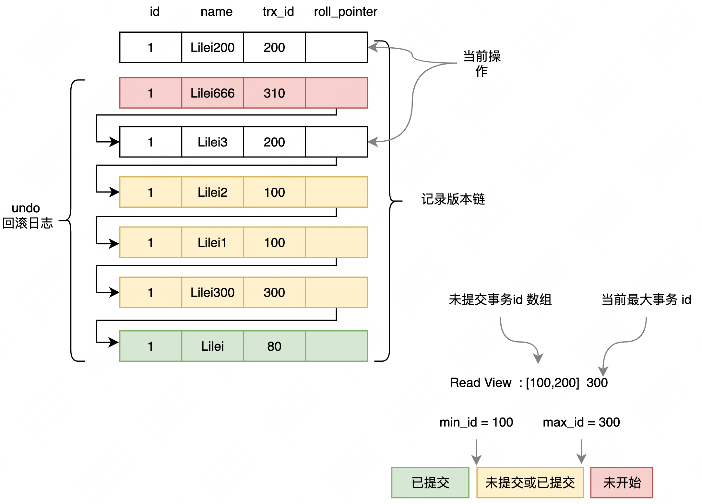

[TOC]

# MVCC

MVCC  Multi-Version Concurrency Control，多版本并发控制。

- Mysql 在读已提交和可重复读隔离级别下都实现了MVCC机制。

- MySQL 对一行数据的读和写两个操作默认是不会通过加锁互斥来保证隔离性，可重复读隔离级别是通过 MVCC 机制来保证事务较高的隔离性。
- 串行化隔离级别为了保证较高的隔离性是通过将所有操作加锁互斥来实现的。

## undo 日志版本链
- undo日志版本链是指一行数据被多个事务依次修改过后，在每个事务修改完后，Mysql 会保留修改前的数据 undo 日志
- 用两个隐藏字段 trx_id 和 roll_pointer 把这些 undo日志串联起来形成一个历史记录版本链。
- undo 日志，又称回滚日志

## Read View 一致性视图

- Read View 一致性视图，由执行查询时所有未提交事务 id 数组和已创建的最大事务 id 组成，事务里的任何 sql 查询结果需要从对应版本链里的最新数据开始逐条跟 read-view 做比对从而得到最终的快照结果。
- 可重复读隔离级别，当事务开启，执行任何查询 sql 时会生成当前事务的一致性视图 Read-View，该视图在事务结束之前都不会变化
- 读已提交隔离解绑，当事务开启，每次执行查询 sql 都会重新生成一致性视图 Read-View

## MVCC 工作原理

**MVCC机制的实现就是通过read-view机制与undo版本链比对机制，使得不同的事务会根据数据版本链对比规则读取同一条数据在版本链上的不同版本数据。**

- undo 回滚日志包含两个隐藏列，trx_id 存在 MySQL 事务 id，roll_pointer 指向上一次 undo 日志的地址。
- 一致性视图 Read View 当前事务里，执行第一次查询 SQL 时，对该行操作过但未提交的事务 id 数组，如图[100,200]，还包含当前最大事务id，如图 300（图中 300 未在未提交数组中，说明 300 事务已经提交）
- 版本链比对规则：
  - 如果 row 的 trx_id 落在绿色部分( trx_id<min_id )，表示这个版本是已提交的事务生成的，这个数据是可见的；
  - 如果 row 的 trx_id 落在红色部分( trx_id>max_id )，表示这个版本是由将来启动的事务生成的，是不可见的(若 row 的 trx_id 就是当前自己的事务是可见的）
  - 如果 row 的 trx_id 落在黄色部分(min_id <=trx_id<= max_id)，那就包括两种情况
    - 若 row 的 trx_id 在视图数组中，表示这个版本是由还没提交的事务生成的，不可见(若 row 的 trx_id 就是当前自己的事务是可见的)；
    - 若 row 的 trx_id 不在视图数组中，表示这个版本是已经提交了的事务生成的，可见。

# 思考

- MVCC 能解决什么问题，如何解决的，好处是？
  - 通过 MVCC 机制来保证事务较高的隔离性。
    - RC 解决脏读问题
    - RR 解决脏读问题 + 不可重复读问题

- RC 的 MVCC 为啥依然不能解决不可重复读？RR 的 MVCC 为啥能解决？
  - 可重复读隔离级别，当事务开启，执行任何查询 sql 时会生成当前事务的一致性视图 Read-View，该视图在事务结束之前都不会变化
  - 读已提交隔离解绑，当事务开启，每次执行查询 sql 都会重新生成一致性视图 Read-View

# 参考

- https://zhuanlan.zhihu.com/p/340600156
- https://www.jianshu.com/p/8845ddca3b23
