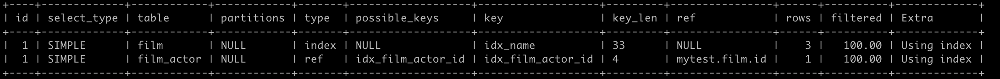
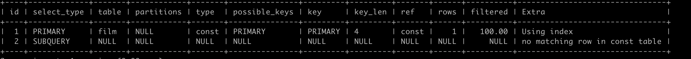

[TOC]

# Explain

```
explain select film_id from film left join film_actor on film.id = film_actor.film_id;
```



```
explain select (select 1 from actor where id = 1) from (select * from film where id = 1) der;
```



## id

id列的编号是 select 的序列号，有几个 select 就有几个id，并且id的顺序是按 select 出现的顺序增长的。id列越大执行优先级越高，id相同则从上往下执行，id为NULL最后执行。

## select_type

select_type 表示对应行是简单还是复杂的查询。

- simple：简单查询。查询不包含子查询和union
- primary：复杂查询中最外层的 select
- subquery：包含在 select 中的子查询（不在 from 子句中）
- derived：包含在 from 子句中的子查询。MySQL会将结果存放在一个临时表中，也称为派生表（derived的英文含义）
- union：在 union 中的第二个和随后的 select

## table

这一列表示 explain 的一行正在访问哪个表。

## type [**优化的关键字段**]

这一列表示关联类型或访问类型，即MySQL决定如何查找表中的行，查找数据行记录的大概范围。依次从最优到最差分别为：**system > const > eq_ref > ref > range > index > ALL**。一般来说，**得保证查询达到range级别，最好达到ref**

- const：mysql能对查询的某部分进行优化并将其转化成一个常量（可以看show warnings 的结果）。用于primary key 或 unique key 的所有列与常数比较时，所以表最多有一个匹配行，读取1次，速度比较快。
- system是const的特例，表里只有一条元组匹配时为system
- eq_ref：primary key 或 unique key 索引的所有部分被连接使用 ，最多只会返回一条符合条件的记录。这可能是在 const 之外最好的联接类型了，简单的 select 查询不会出现这种 type。
- ref：相比 eq_ref，不使用唯一索引，而是使用普通索引或者唯一性索引的部分前缀，索引要和某个值相比较，可能会找到多个符合条件的行。
- range：范围扫描通常出现在 in(), between ,> ,<, >= 等操作中。使用一个索引来检索给定范围的行。
- index：扫描全索引就能拿到结果，一般是扫描某个二级索引，这种扫描不会从索引树根节点开始快速查找，而是直接对二级索引的叶子节点遍历和扫描，速度还是比较慢的，这种查询一般为使用覆盖索引，二级索引一般比较小，所以这种通常比ALL快一些。
- ALL：即全表扫描，扫描你的聚簇索引的所有叶子节点。通常情况下这需要增加索引来进行优化了。

## possible_keys

这一列显示查询可能使用哪些索引来查找。

## key

这一列显示mysql实际采用哪个索引来优化对该表的访问。explain 时可能出现 possible_keys 有列，而 key 显示 NULL 的情况，这种情况是因为表中数据不多，mysql认为索引对此查询帮助不大，选择了全表查询。

## key_len

这一列显示了mysql在索引里使用的字节数，通过这个值可以算出具体使用了索引中的哪些列。

key_len计算规则如下：

- 字符串，char(n)和varchar(n)，5.0.3以后版本中，n均代表字符数，而不是字节数，如果是utf-8，一个数字或字母占1个字节，一个汉字占3个字节
  - char(n)：如果存汉字长度就是 3n 字节
  - varchar(n)：如果存汉字则长度是 3n + 2 字节，加的2字节用来存储字符串长度，因为
  - varchar是变长字符串
- 数值类型

  - tinyint：1字节

  - smallint：2字节

  - int：4字节

  - bigint：8字节　　
- 时间类型　

  - date：3字节

  - timestamp：4字节

  - datetime：8字节
- 如果字段允许为 NULL，需要1字节记录是否为 NULL

索引最大长度是768字节，当字符串过长时，mysql会做一个类似左前缀索引的处理，将前半部分的字符提取出来做索引。

## ref列

这一列显示了在key列记录的索引中，表查找值所用到的列或常量，常见的有：const（常量），字段名（例：film.id）

## rows列

这一列是mysql估计要读取并检测的行数，注意这个不是结果集里的行数。

## Extra列

这一列展示的是额外信息

- **Using index**：使用覆盖索引

  **覆盖索引定义**：mysql执行计划explain结果里的key有使用索引，如果select后面**查询的字段**都可以从这个索引的树中获取，这种情况一般可以说是用到了覆盖索引，extra里一般都有using index；覆盖索引一般针对的是辅助索引，整个查询结果只通过辅助索引就能拿到结果，不需要通过辅助索引树找到主键，再通过主键去主键索引树里获取其它字段值。**即，只需要遍历命中的索引，不需要再查找主键索引获取额外的字段信息。**

- **Using where**：使用 where 语句来处理结果，并且查询的列未被索引覆盖

- **Using index condition**：查询的列不完全被索引覆盖，where条件中是一个前导列的范围；
- **Using temporary**：mysql需要创建一张临时表来处理查询。出现这种情况一般是要进行优化的，首先是想到用索引来优化。
- **Using filesort**：将用外部排序而不是索引排序，数据较小时从内存排序，否则需要在磁盘完成排序。这种情况下一般也是要考虑使用索引来优化的。
  - 单路排序：是一次性取出满足条件行的所有字段，然后在sort buffer中进行排序
  - 双路排序（又叫回表排序模式）：是首先根据相应的条件取出相应的排序字段和可以直接定位行数据的行 ID，然后在 sort buffer 中进行排序，排序完后需要再次取回其它需要的字段；
