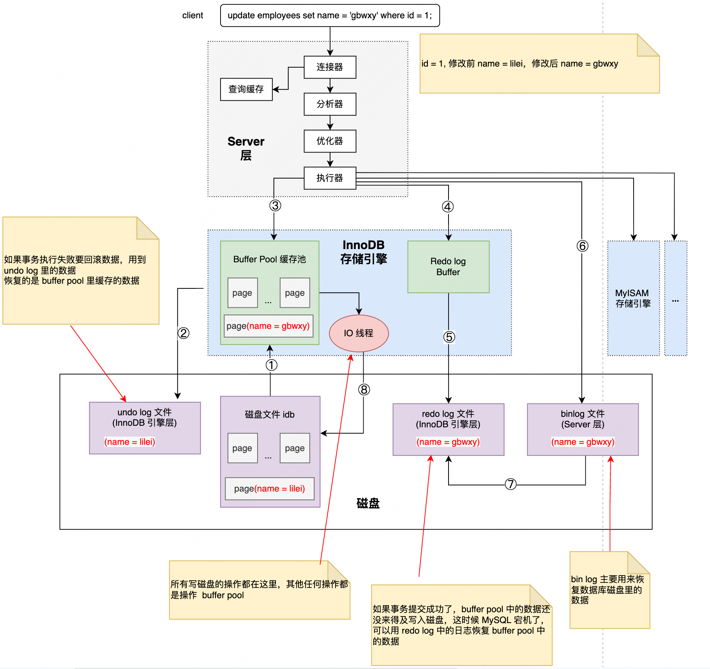

# 一条 SQL 是如何执行的

1. 从磁盘中查询数据，读取磁盘的数据是以 page 为单位，最少读取 1 个 page 的数据
2. 记录回滚日志，写入旧值便于回滚
3. 更新内存，更新 buffer pool 中的数据
4. 写 redo 日志
5. 准备提交事务， redo 日志写入磁盘
6. 准备提交事务，binlog 日志写入磁盘
7. 写入 commit 记录到 redo 文件，标记事务已提交，该标记为了保证 redo log 和 bin log 数据一致
8. 随机写入磁盘，以 page 为单位写入磁盘

**注意**

- 所有写磁盘的操作都在独立的 IO 写盘线程中进行的，其他任何操作都是操作 buffer pool 
- Undo log ：如果事务执行失败要回滚数据，用到 undo log 里的数据；恢复的是 buffer pool 里缓存的数据
- Redo log ：如果事务提交成功了，buffer pool 中的数据还没来得及写入磁盘，这时候 MySQL 宕机了，可以用 redo log 中的日志恢复 buffer pool 中的数据
- bin log ：主要用来恢复数据库磁盘里的数据
