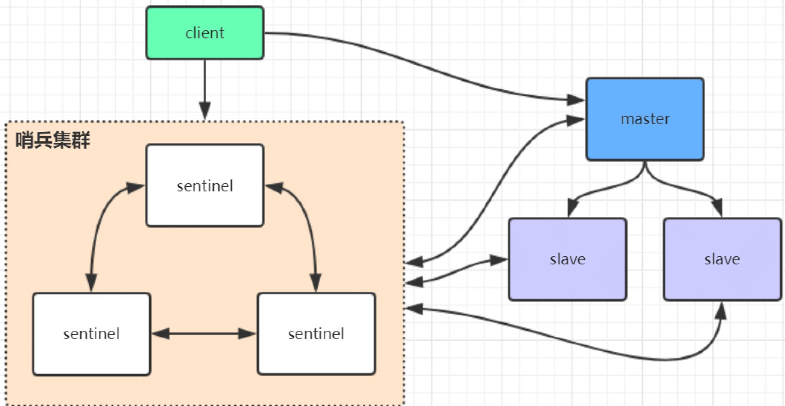
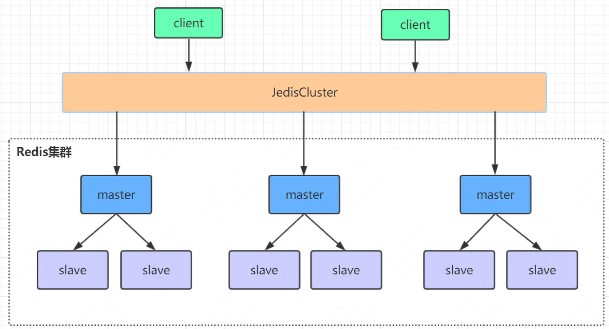

[TOC]

# Redis 主从架构

## 从节点请求全量复制

- 主节点收到 psync 命令后先做一次 rdb 备份，然后增量数据以命令的形式记录到repl buffer 中。发送完 rdb 数据后，然后再发送 buffer 到从节点
- 如果master收到了多个slave并发连接请求，它只会进行一次持久化，然后再把这一份持久化的数据发送给多个并发连接的slave。

## 从节点请求增量复制

- 从节点重新建立链接的时，会把从节点侧的 offset 一同发给主节点
- 如果master进程id变化了，或者从节点数据下标offset太旧，已经不在master的缓存队列里了，那么将会进行一次全量数据的复制。

## 主从复制风暴

- 多个从节点同时复制主节点导致主节点压力过大

- 可以做如下架构，让部分从节点与从节点(与主节点同步)同步数据

  

# Redis 哨兵架构

- sentinel 哨兵是特殊的redis服务，不提供读写服务，主要用来监控redis实例节点

- 如果master节点异常，则会做主从切换，将某一台slave作为master，哨兵的配置略微复杂，并且性能和高可用性等各方面表现

  一般，特别是在主从切换的瞬间存在**访问瞬断**的情况

- 哨兵模式只有一个主节点对外提供服务，没法支持很高的并发，且单个主节点内存也不宜设置得过大，否则会导致持久化文件过大，影响数据恢复或主从同步的效率

## 哨兵选举流程

# Redis 集群架构

- Redis 集群是一个由多个主从节点群组成的分布式服务器群，它具有复制、高可用和分片特性

- Redis 集群不需要 sentinel 哨兵也能完成节点移除和故障转移的功能。集群的性能和高可用性均优于哨兵模式，且配置非常简单。

- Redis 集群没有中心节点，可水平扩展，据官方文档称可以线性扩展到上万个节点(官方推荐不超过1000个节点)。

- Redis集群需要至少三个 master 节点，并且建议奇数个节点（偶数个节点也可以部署成功，但是不建议，因为 master 选项需要剩余的 master 节点必须大于一般的节点个数才能进行）

  

## 槽位定位算法与重定向

## 集群节点间的通信机制

## 集群选举流程

## 集群脑裂数据丢失问题

## 集群为什么至少需要三个master节点，并且推荐节点数为奇数？

