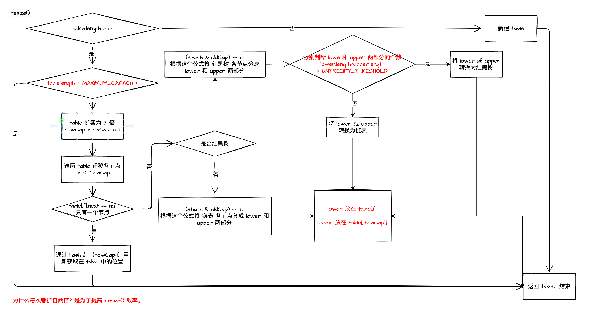
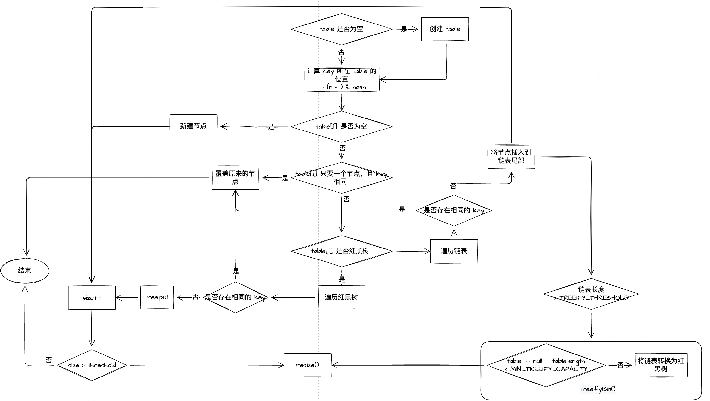

# HashMap

- table + 链表或红黑树 组成
- tableCap > MIN_TREEIFY_CAPACITY && table[i].length > TREEIFY_THRESHOLD 时链表才能转换为红黑树。因为链表转变为红黑树的目的是为了解决链表过长，导致查询和插入效
  率慢的问题，而如果要解决这个问题，也可以通过数组扩容，把链表缩短也可以解决这个问题。所以在数组长度还不太长的情况，可以先通过数组扩容来解 决链表过长的问

```java
public class HashMap {

    // table 默认初始大小
    static final int DEFAULT_INITIAL_CAPACITY = 1 << 4; // aka 16

    // table 最大容量
    static final int MAXIMUM_CAPACITY = 1 << 30;

    // 默认负载因子，threshold = tableCap * DEFAULT_LOAD_FACTOR，当 size > threshold 时触发扩容
    static final float DEFAULT_LOAD_FACTOR = 0.75f;

    // 允许链表转换为红黑树的 table 最小容量， tableCap > MIN_TREEIFY_CAPACITY  && table[i].length > TREEIFY_THRESHOLD 时，链表才能转换为红黑树
    static final int MIN_TREEIFY_CAPACITY = 64;

    // 链表转换为红黑树的阈值
    static final int TREEIFY_THRESHOLD = 8;

    // 红黑树退化为链表的阈值
    static final int UNTREEIFY_THRESHOLD = 6;

}
```

## 扩容流程


为什么每次都扩容两倍? 是为了提高 resize() 效率。

- 当 put 一个元素 e 到 Map 中，查找 e 放置的 table[]  的位置 i = e.hash & (cap -1)
- 当扩容的时候，需要给 table[i] 上所有的元素都重新分配位置，如果变量所有的元素效率比较低，HashMap 采用的策略是将 table[i] 上的元素分成 lower 和 upper 两部分，lower 部分仍然放在 i
  位置，upper 部分放到 i + oldCap 位置
- e.hash & oldCap == 0 --> lower
- e.hash & newCap == 1 --> upper

## put 流程

