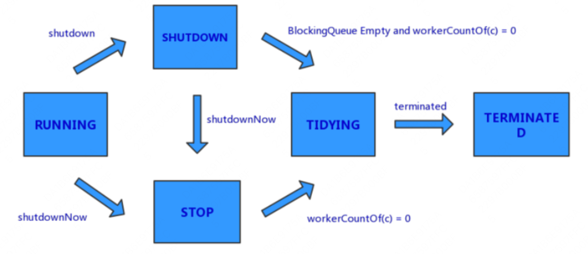
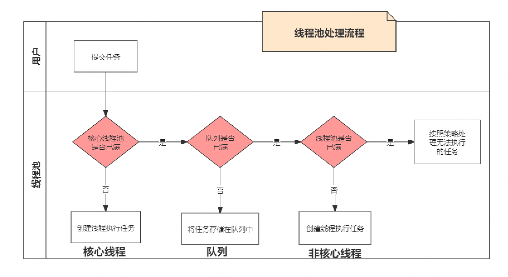

# 线程池

## ThreadPoolExecutor 构造函数各参数含义

```java
public class ThreadPoolExecutor {

    public ThreadPoolExecutor(
          // 核心线程数，线程池中存活的最少线程数（除非 allowCoreThreadTimeOut = true）
          int corePoolSize,
          // 最大线程数
          int maximumPoolSize,
          // 非核心线程，销毁之前最大空闲时间
          long keepAliveTime,
          // keepAliveTime 的时间单位
          TimeUnit unit,
          // 缓存队列，该队列只缓存 execute() 提交的 Runnable 任务
          BlockingQueue<Runnable> workQueue,
          // 线程创建时使用的工程
          ThreadFactory threadFactory,
          // 拒绝处理策略，线程池满了&缓存队列也满了，如何处理再提交的任务
          RejectedExecutionHandler handler) {}

    /** The runState provides the main lifecycle control, taking on values:
     *
     *   RUNNING:  Accept new tasks and process queued tasks
     *   SHUTDOWN: Don't accept new tasks, but process queued tasks
     *   STOP:     Don't accept new tasks, don't process queued tasks,
     *             and interrupt in-progress tasks
     *   TIDYING:  All tasks have terminated, workerCount is zero,
     *             the thread transitioning to state TIDYING
     *             will run the terminated() hook method
     *   TERMINATED: terminated() has completed
     *
     // runState is stored in the high-order bits
     private static final int RUNNING    = -1 << COUNT_BITS;
     private static final int SHUTDOWN   =  0 << COUNT_BITS;
     private static final int STOP       =  1 << COUNT_BITS;
     private static final int TIDYING    =  2 << COUNT_BITS;
     private static final int TERMINATED =  3 << COUNT_BITS;
     */
    // 高 3 位 标识线程池状态，后面 29 位标识线程池中线程的个数
    private final AtomicInteger ctl = new AtomicInteger(ctlOf(RUNNING, 0));

    // 阻塞队列
    private final BlockingQueue<Runnable> workQueue;

    // 任务set
    private final HashSet<Worker> workers = new HashSet<Worker>();

    // 主锁，用于保证 workers & largestPoolSize etc. 等参数的线程安全
    private final ReentrantLock mainLock = new ReentrantLock();

    // mainLock 的条件队列
    private final Condition termination = mainLock.newCondition();

    // 任务 --> 扩展了 AQS ，实现了 Runnable
    private final class Worker extends AbstractQueuedSynchronizer implements Runnable {

        // 新建一个线程，该线程的 Runnable 指向自己
        final Thread thread = ThreadFactory.newThread(this);

        // 提交的任务
        Runnable firstTask;

        @Override
        public void run() {
            runWorker(this);
        }
    }

    // 执行任务的主要逻辑
    final void runWorker(Worker w) {}

    public void execute(Runnable command) {}

}

```



## 任务提交与任务执行顺序

- 任务提交顺序：核心线程 -> 缓存队列 -> 非核心线程
- 任务执行顺序：核心线程 -> 非核心线程 -> 缓存队列



## 线程池如何执行任务的

```java
 public class demo {

    //自定义线程
    ThreadPoolExecutor threadPoolExecutor = new ThreadPoolExecutor(10, 20, 0L, TimeUnit.MILLISECONDS,
                                                                   new LinkedBlockingQueue<Runnable>(10),
                                                                   new MonkeyRejectedExecutionHandler());

    public static void main(String[] args) {
        for (int i = 1; i <= 100; i++) {
            threadPoolExecutor.execute(new MyTask(i));
        }
    }

    class MyTask implements Runnable {

        int i = 0;

        public MyTask(int i) {
            this.i = i;
        }

        @Override
        public void run() {
            System.out.println(Thread.currentThread().getName() + "程序员做第" + i + "个项目");
            try {
                //业务逻辑
                Thread.sleep(3000L);
            } catch (Exception e) {
                e.printStackTrace();
            }
        }
    }
}
```

- 如果设置 allowCoreThreadTimeOut = true 则当核心线程超过 keepAliveTime 仍然从阻塞队列 workQueue 中获取不到任务，则也会被销毁。
- 如果阻塞队列 workQueue 中还有任务，线程池中最少是要存在一个线程。
- 如果核心线程和非核心线程都被销毁，即线程池中 ctl 记录线程个数的低29位等于 0，再次调用 excuse() 或 submit() 提交任务时，会再次创建核心线程 --> 阻塞队列 --> 非核心线程
- ThreadPoolExecutor内部有实现4个拒绝策略：
    - CallerRunsPolicy，由调用execute方法提交任务的线程来执行这个任务；
    - AbortPolicy，抛出异常RejectedExecutionException拒绝提交任务；
    - DiscardPolicy，直接抛弃任务，不做任何处理；
    - DiscardOldestPolicy，去除任务队列中的第一个任务（最旧的），重新提交；

## ScheduledThreadPoolExecutor

- scheduledAtFixedRate 固定：延迟指定时间后执行一次，之后按照固定的时长周期执行；
- scheduledWithFixedDelay 非固定：延迟指定时间后执行一次，之后按照：上一次任务执行时长 + 周期的时长 的时间去周期执行；
- ScheduledThreadPoolExecutor 实现了延迟队列 DelayedWorkQueue，其实是一个小根堆，根据任务要执行的

```java
public class ScheduledThreadPoolExecutor {

    /**
     * 构造函数
     */
    public ScheduledThreadPoolExecutor(int corePoolSize, ThreadFactory threadFactory,
                                       RejectedExecutionHandler handler) {
        /**
         * 最大线程数是 Integer.MAX_VALUE
         * 阻塞队列 - DelayedWorkQueue() 初始大小是 16，可以自动扩容
         */
        ThreadPoolExecutor(corePoolSize, Integer.MAX_VALUE, 0, NANOSECONDS, new DelayedWorkQueue(), threadFactory,
                           handler);
    }

    /**
     * 固定周期执行，每 period 执行一次
     * 注意：如果上一次没有执行完成，即使时间到了也不会触发执行
     */
    public ScheduledFuture<?> scheduleAtFixedRate(Runnable command, long initialDelay, long period, TimeUnit unit) {

        ScheduledFutureTask<Void> sft = new ScheduledFutureTask<Void>(command, null, triggerTime(initialDelay, unit),
                                                                      unit.toNanos(period));
        sft.outerTask = t;
        // ThreadPoolExecutor.addWork() 添加 work 到线程池的逻辑
        delayedExecute(t);
        return t;
    }

    /**
     * 执行完成后延迟 delay 时间执行
     */
    public ScheduledFuture<?> scheduleWithFixedDelay(Runnable command, long initialDelay, long delay, TimeUnit unit) {
        ScheduledFutureTask<Void> sft = new ScheduledFutureTask<Void>(command, null, triggerTime(initialDelay, unit),
                                                                      unit.toNanos(-delay));
        sft.outerTask = t;
        // ThreadPoolExecutor.addWork() 添加 work 到线程池的逻辑
        delayedExecute(t);
        return t;
    }

    /**
     * 可执行任务封装
     *
     */
    private class ScheduledFutureTask<V> extends FutureTask<V> implements RunnableScheduledFuture<V> {

        RunnableScheduledFuture<V> outerTask = this;

        /**
         * 周期执行时间
         * scheduleAtFixedRate period > 0
         * scheduleWithFixedDelay period < 0
         */
        private final long period;

        // 执行主逻辑
        public void run() {
            boolean periodic = isPeriodic();
            if (!canRunInCurrentRunState(periodic))
                cancel(false);
            else if (!periodic)
                ScheduledFutureTask.super.run();
            else if (ScheduledFutureTask.super.runAndReset()) { // 如果是周期执行的，走这个分支
                // 执行完成后设置下次执行时间
                setNextRunTime();
                // 将当前任务再次入队
                reExecutePeriodic(outerTask);
            }
        }

        /**
         * 执行完成后，设置下一次执行的时间
         */
        private void setNextRunTime() {
            long p = period;
            if (p > 0)
                time += p;  // scheduledAtFixedRate 走这个分支，本次执行的开始时间 + 延迟时间 period
            else
                time = triggerTime(-p); // scheduledWithFixedDelay 走这个分支，当前时间(执行完成的时间) + 延迟时间 period
        }

        /**
         * 当前时间 + delay  放置 long 类型溢出处理
         */
        long triggerTime(long delay) {
            // 防止 long 类型溢出处理
            return now() + ((delay < (Long.MAX_VALUE >> 1)) ? delay : overflowFree(delay));
        }

        /**
         * DelayedWorkQueue 小根堆的排序依据
         */
        public int compareTo(Delayed other) {
            if (other == this) // compare zero if same object
                return 0;
            if (other instanceof ScheduledFutureTask) {
                ScheduledFutureTask<?> x = (ScheduledFutureTask<?>) other;
                long diff = time - x.time;
                if (diff < 0)
                    return -1;
                else if (diff > 0)
                    return 1;
                else if (sequenceNumber < x.sequenceNumber)
                    return -1;
                else
                    return 1;
            }
            long diff = getDelay(NANOSECONDS) - other.getDelay(NANOSECONDS);
            return (diff < 0) ? -1 : (diff > 0) ? 1 : 0;
        }
    }

    /**
     * 延迟阻塞队列 
     * 数组 queue 维护一个小根堆，使用 siftUp() 和 siftDown()
     *
     */
    static class DelayedWorkQueue extends AbstractQueue<Runnable> implements BlockingQueue<Runnable> {

        /**
         * 初始大小
         */
        private static final int INITIAL_CAPACITY = 16;

        /**
         * size >= queue.length 时，就扩容 1.5 倍
         */
        private void grow() {
            int oldCapacity = queue.length;
            int newCapacity = oldCapacity + (oldCapacity >> 1); // grow 50%
            if (newCapacity < 0) // overflow
                newCapacity = Integer.MAX_VALUE;
            queue = Arrays.copyOf(queue, newCapacity);
        }

        /**
         * 存任务的数组
         */
        private RunnableScheduledFuture<?>[] queue = new ScheduledFutureTask<?>[INITIAL_CAPACITY];

        private final ReentrantLock lock = new ReentrantLock();

        /**
         * 任务个数
         */
        private int size = 0;

        /**
         * 上漂，将元素添加到数组最后，然后上漂
         */
        private void siftUp(int k, RunnableScheduledFuture<?> key) {
            while (k > 0) {
                int parent = (k - 1) >>> 1;
                RunnableScheduledFuture<?> e = queue[parent];
                if (key.compareTo(e) >= 0)
                    break;
                queue[k] = e;
                setIndex(e, k);
                k = parent;
            }
            queue[k] = key;
            setIndex(key, k);
        }

        /**
         * 下移，当 head 取出后，将最后一个放在 head 上，然后下移
         */
        private void siftDown(int k, RunnableScheduledFuture<?> key) {
            int half = size >>> 1;
            while (k < half) {
                int child = (k << 1) + 1;
                RunnableScheduledFuture<?> c = queue[child];
                int right = child + 1;
                if (right < size && c.compareTo(queue[right]) > 0)
                    c = queue[child = right];
                if (key.compareTo(c) <= 0)
                    break;
                queue[k] = c;
                setIndex(c, k);
                k = child;
            }
            queue[k] = key;
            setIndex(key, k);
        }

    }
}
```

## execute() vs submit() ？

- submit() 可以传入 Runnable 传入的是 Callable ，有返回值
- execute() 只能传入 Runnable，没有返回值